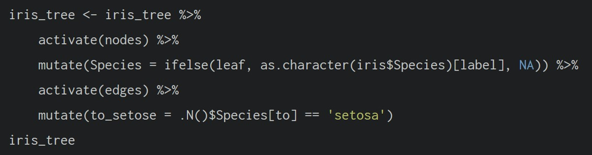
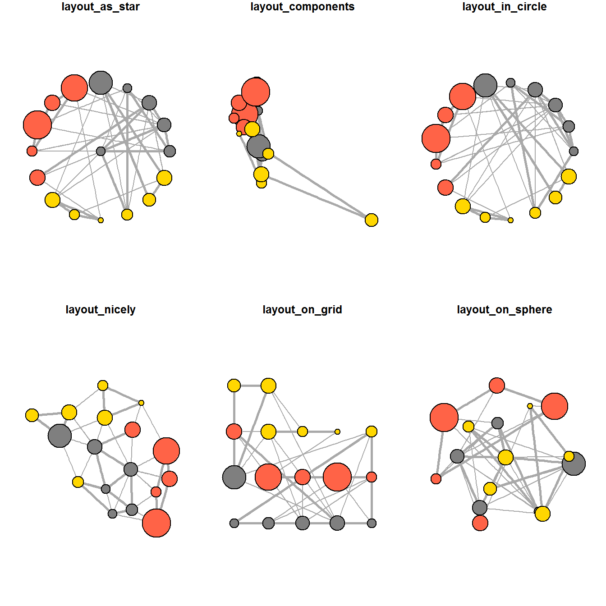

### 1. Overview

In this hands-on exercise, four network data modelling and visualisation packages will be installed and launched. They are igraph, tidygraph, ggraph and visNetwork. Beside these four packages, **tidyverse** and [**lubridate**](https://lubridate.tidyverse.org/), an R package specially designed to handle and wrangling time data will be installed and launched too.

```{r}
pacman::p_load(igraph, tidygraph, ggraph, 
               visNetwork, lubridate, clock,
               tidyverse, graphlayouts)
```

### 2. Data

The data sets used in this hands-on exercise is from an oil exploration and extraction company. There are two data sets. One contains the nodes data and the other contains the edges (also know as link) data.

#### 2.1. Edges data

-   *GAStech-email_edges.csv* which consists of two weeks of 9063 emails correspondances between 55 employees.

#### 2.2. Nodes data

-   *GAStech_email_nodes.csv* which consist of the names, department and title of the 55 employees.

#### 2.3. Importing data

We will import **GAStech_email_node.csv** and **GAStech_email_edges-v2.csv** into RStudio environment by using *read_csv()* of **readr** package.

```{r}
GAStech_nodes <- read_csv("Data files/GAStech_email_node.csv")
GAStech_edges <- read_csv("Data files/GAStech_email_edge-v2.csv")
```

Next, we will examine the structure of the data frame using *glimpse()* of **dplyr**.

```{r}
glimpse(GAStech_edges)
```

::: caution-warning
The output report of GAStech_edges above reveals that the *SentDate* is treated as “Character” data type instead of *date* data type. This is an error! Before we continue, it is important for us to change the data type of *SentDate* field back to “Date”” data type.
:::

#### 2.4. Wrangling data

**Wrangling time**

```{r}
GAStech_edges <- GAStech_edges %>%
  mutate(SendDate = dmy(SentDate)) %>%
  mutate(Weekday = wday(SentDate,
                        label = TRUE,
                        abbr = FALSE))
```

::: caution-note
-   both *dmy()* and *wday()* are functions of **lubridate** package. [**lubridate**](https://r4va.netlify.app/cran.r-project.org/web/packages/lubridate/vignettes/lubridate.html) is an R package that makes it easier to work with dates and times.

-   *dmy()* transforms the *SentDate* to Date data type.

-   *wday()* returns the day of the week as a decimal number or an ordered factor if label is TRUE. The argument abbr is FALSE keep the daya spells in full, i.e. Monday. The function will create a new column in the data.frame i.e. Weekday and the output of *wday()* will save in this newly created field.

-   the values in the *Weekday* field are in ordinal scale.
:::

**Reviewing revised date fields**

Showing the data structure of the reformatted *GAStech_edges* data frame.

```{r}
glimpse(GAStech_edges)
```

**Wrangling attributes**

A close examination of *GAStech_edges* data.frame reveals that it consists of individual e-mail flow records. This is not very useful for visualisation.

In view of this, we will aggregate the individual by date, senders, receivers, main subject and day of the week.

```{r}
GAStech_edges_aggregated <- GAStech_edges %>%
  filter(MainSubject == "Work related") %>%
  group_by(source, target, Weekday) %>%
    summarise(Weight = n()) %>%
  filter(source!=target) %>%
  filter(Weight > 1) %>%
  ungroup()
```

::: caution-note
-   four functions from **dplyr** package are used. They are: *filter()*, *group()*, *summarise()*, and *ungroup()*.

-   The output data.frame is called **GAStech_edges_aggregated**.

-   A new field called *Weight* has been added in GAStech_edges_aggregated.
:::

**Reviewing revised edges file**

```{r}
glimpse(GAStech_edges_aggregated)
```

#### 2.5. Creating network objects using **tidygraph**

In this section, you will learn how to create a graph data model by using **tidygraph** package. It provides a tidy API for graph/network manipulation. While network data itself is not tidy, it can be envisioned as two tidy tables, one for node data and one for edge data. tidygraph provides a way to switch between the two tables and provides dplyr verbs for manipulating them. Furthermore it provides access to a lot of graph algorithms with return values that facilitate their use in a tidy workflow.

Before getting started, you are advised to read these two articles:

-   [Introducing tidygraph](https://www.data-imaginist.com/2017/introducing-tidygraph/)

-   [tidygraph 1.1 - A tidy hope](https://www.data-imaginist.com/2018/tidygraph-1-1-a-tidy-hope/)

##### 2.5.1. *tbl_graph* object

Two functions of **tidygraph** package can be used to create network objects, they are:

-   [*tbl_graph()*](https://tidygraph.data-imaginist.com/reference/tbl_graph.html) creates a **tbl_graph** network object from nodes and edges data.

-   [*as_tbl_graph()*](https://tidygraph.data-imaginist.com/reference/tbl_graph.html) converts network data and objects to a **tbl_graph** network. Below are network data and objects supported by *as_tbl_graph().*

    -   a node data.frame and an edge data.frame,

    -   data.frame, list, matrix from base,

    -   igraph from igraph,

    -   network from network,

    -   dendrogram and hclust from stats,

    -   Node from data.tree,

    -   phylo and evonet from ape, and

    -   graphNEL, graphAM, graphBAM from graph (in Bioconductor).

##### 2.5.2. dplyr verbs in tidygraph

-   *activate()* verb from **tidygraph** serves as a switch between tibbles for nodes and edges. All dplyr verbs applied to **tbl_graph** object are applied to the active tibble.



-   In the above the *.N()* function is used to gain access to the node data while manipulating the edge data. Similarly *.E()* will give you the edge data and *.G()* will give you the **tbl_graph** object itself.

##### 2.5.3. *tbl_graph()* to build tidygraph data model

In this section, you will use `tbl_graph()` of **tinygraph** package to build an tidygraph’s network graph data.frame.

Before typing the codes, you are recommended to review to reference guide of [*tbl_graph()*](https://tidygraph.data-imaginist.com/reference/tbl_graph.html)*.*

```{r}
GAStech_graph <- tbl_graph(nodes = GAStech_nodes,
                           edges = GAStech_edges_aggregated, 
                           directed = TRUE)
```

Reviewing the output of tidygraph's graph object

```{r}
GAStech_graph
```

::: caution-note
-   The output above reveals that *GAStech_graph* is a tbl_graph object with 54 nodes and 4541 edges.

-   The command also prints the first six rows of “Node Data” and the first three of “Edge Data”.

-   It states that the Node Data is **active**. The notion of an active tibble within a tbl_graph object makes it possible to manipulate the data in one tibble at a time.
:::

##### 2.5.4. Changing the active object

The nodes tibble data frame is activated by default, but you can change which tibble data frame is active with the *activate()* function. Thus, if we wanted to rearrange the rows in the edges tibble to list those with the highest “weight” first, we could use *activate()* and then *arrange()*.

```{r}
GAStech_graph %>%
  activate(edges) %>%
  arrange(desc(Weight))
```

### 3. Plotting Static Network Graphs (with ggraph package)

[**ggraph**](https://ggraph.data-imaginist.com/) is an extension of **ggplot2**, making it easier to carry over basic ggplot skills to the design of network graphs.

As in all network graph, there are three main aspects to a **ggraph**’s network graph, they are:

-   [nodes](https://cran.r-project.org/web/packages/ggraph/vignettes/Nodes.html),

-   [edges](https://cran.r-project.org/web/packages/ggraph/vignettes/Edges.html) and

-   [layouts](https://cran.r-project.org/web/packages/ggraph/vignettes/Layouts.html).

For a comprehensive discussion of each of this aspect of graph, please refer to their respective vignettes provided.

#### 3.1. Plotting a basic network graph

The code chunk below uses [*ggraph()*](https://ggraph.data-imaginist.com/reference/ggraph.html), [*geom-edge_link()*](https://ggraph.data-imaginist.com/reference/geom_edge_link.html) and [*geom_node_point()*](https://ggraph.data-imaginist.com/reference/geom_node_point.html) to plot a network graph by using *GAStech_graph*. Before your get started, it is advisable to read their respective reference guide at least once.

```{r}
ggraph(GAStech_graph) +
  geom_edge_link() +
  geom_node_point()
```

::: caution-note
-   The basic plotting function is `ggraph()`, which takes the data to be used for the graph and the type of layout desired. Both of the arguments for `ggraph()` are built around *igraph*. Therefore, `ggraph()` can use either an *igraph* object or a *tbl_graph* object.
:::

#### 3.2. Changing default network graph theme

In this section, you will use [*theme_graph()*](https://ggraph.data-imaginist.com/reference/theme_graph.html) to remove the x and y axes. Before your get started, it is advisable to read it’s reference guide at least once.

```{r}
g <- ggraph(GAStech_graph) + 
  geom_edge_link(aes()) +
  geom_node_point(aes())

g + theme_graph()
```

::: caution-note
-   **ggraph** introduces a special ggplot theme that provides better defaults for network graphs than the normal ggplot defaults. `theme_graph()`, besides removing axes, grids, and border, changes the font to Arial Narrow (this can be overridden).

-   The ggraph theme can be set for a series of plots with the `set_graph_style()` command run before the graphs are plotted or by using `theme_graph()` in the individual plots.
:::

#### 3.3. Changing coloring of the plot

Furthermore, *theme_graph()* makes it easy to change the coloring of the plot.

```{r}
g <- ggraph(GAStech_graph) + 
  geom_edge_link(aes(colour = 'grey50')) +
  geom_node_point(aes(colour = 'grey40'))

g + theme_graph(background = 'grey10',
                text_colour = 'white')
```

#### 3.4. Working with ggraph's layouts

**ggraph** support many layout for standard used, they are: star, circle, nicely (default), dh, gem, graphopt, grid, mds, spahere, randomly, fr, kk, drl and lgl. Figures below and on the right show layouts supported by *ggraph()*.



#### 3.5.  **Fruchterman and Reingold layout**

```{r}
g <- ggraph(GAStech_graph, 
            layout = "fr") +
  geom_edge_link(aes()) +
  geom_node_point(aes())

g + theme_graph()
```

::: caution-note
-   *layout* argument is used to define the layout to be used.
:::

#### 3.6. Modifying network nodes

In this section, you will colour each node by referring to their respective departments.

```{r}
g <- ggraph(GAStech_graph, 
            layout = "nicely") + 
  geom_edge_link(aes()) +
  geom_node_point(aes(colour = Department, 
                      size = 3))

g + theme_graph()
```

::: caution-note
-   *geom_node_point* is equivalent in functionality to *geo_point* of **ggplot2**. It allows for simple plotting of nodes in different shapes, colours and sizes. In the codes chnuks above colour and size are used.
:::

#### 3.7. Modifying edges

The thickness of the edges will be mapped with the *Weight* variable.

```{r}
g <- ggraph(GAStech_graph, 
            layout = "nicely") +
  geom_edge_link(aes(width=Weight), 
                 alpha=0.2) +
  scale_edge_width(range = c(0.1, 5)) +
  geom_node_point(aes(colour = Department), 
                  size = 3)

g + theme_graph()
```

::: caution-note
-   *geom_edge_link* draws edges in the simplest way - as straight lines between the start and end nodes. But, it can do more that that. In the example above, argument *width* is used to map the width of the line in proportional to the Weight attribute and argument alpha is used to introduce opacity on the line.
:::

### 4. Creating facet graphs

Another very useful feature of **ggraph** is faceting. In visualising network data, this technique can be used to reduce edge over-plotting in a very meaning way by spreading nodes and edges out based on their attributes. In this section, you will learn how to use faceting technique to visualise network data.

There are three functions in ggraph to implement faceting, they are:

-   [*facet_nodes()*](https://r4va.netlify.app/chap27) whereby edges are only draw in a panel if both terminal nodes are present here,

-   [*facet_edges()*](https://ggraph.data-imaginist.com/reference/facet_edges.html) whereby nodes are always drawn in al panels even if the node data contains an attribute named the same as the one used for the edge facetting, and

-   [*facet_graph()*](https://ggraph.data-imaginist.com/reference/facet_graph.html) faceting on two variables simultaneously.

#### 4.1. Working with *facet_edges()*

In the code chunk below, [*facet_edges()*](https://ggraph.data-imaginist.com/reference/facet_edges.html) is used. Before getting started, it is advisable for you to read it’s reference guide at least once.

```{r}
set_graph_style()

g <- ggraph(GAStech_graph, 
            layout = "nicely") + 
  geom_edge_link(aes(width=Weight), 
                 alpha=0.2) +
  scale_edge_width(range = c(0.1, 5)) +
  geom_node_point(aes(colour = Department), 
                  size = 2)

g + facet_edges(~Weekday)
```

The code chunk below uses *theme()* to change the position of the legend.

```{r}
set_graph_style()

g <- ggraph(GAStech_graph, 
            layout = "nicely") + 
  geom_edge_link(aes(width=Weight), 
                 alpha=0.2) +
  scale_edge_width(range = c(0.1, 5)) +
  geom_node_point(aes(colour = Department), 
                  size = 2) +
  theme(legend.position = 'bottom')
  
g + facet_edges(~Weekday)
```

#### 4.2. Framed facet graph

The code chunk below adds frame to each graph.

```{r}
set_graph_style() 

g <- ggraph(GAStech_graph, 
            layout = "nicely") + 
  geom_edge_link(aes(width=Weight), 
                 alpha=0.2) +
  scale_edge_width(range = c(0.1, 5)) +
  geom_node_point(aes(colour = Department), 
                  size = 2)
  
g + facet_edges(~Weekday) +
  th_foreground(foreground = "grey80",  
                border = TRUE) +
  theme(legend.position = 'bottom')
```

#### 4.3. Working with *facet_nodes()*

In the code chunkc below, [*facet_nodes()*](https://ggraph.data-imaginist.com/reference/facet_nodes.html) is used. Before getting started, it is advisable for you to read it’s reference guide at least once.

```{r}
set_graph_style()

g <- ggraph(GAStech_graph, 
            layout = "nicely") + 
  geom_edge_link(aes(width=Weight), 
                 alpha=0.2) +
  scale_edge_width(range = c(0.1, 5)) +
  geom_node_point(aes(colour = Department), 
                  size = 2)
  
g + facet_nodes(~Department)+
  th_foreground(foreground = "grey80",  
                border = TRUE) +
  theme(legend.position = 'bottom')
```

### 5. Network Metrics Analysis

#### 5.1. Computing centrality indices

Centrality measures are a collection of statistical indices use to describe the relative important of the actors are to a network. There are four well-known centrality measures, namely: degree, betweenness, closeness and eigenvector. It is beyond the scope of this hands-on exercise to cover the principles and mathematics of these measure here. Students are encouraged to refer to *Chapter 7: Actor Prominence* of **A User’s Guide to Network Analysis in R** to gain better understanding of theses network measures.

```{r}
g <- GAStech_graph %>%
  mutate(betweenness_centrality = centrality_betweenness()) %>%
  ggraph(layout = "fr") + 
  geom_edge_link(aes(width=Weight), 
                 alpha=0.2) +
  scale_edge_width(range = c(0.1, 5)) +
  geom_node_point(aes(colour = Department,
            size=betweenness_centrality))
g + theme_graph()
```

::: caution-note
-   *mutate()* of **dplyr** is used to perform the computation.

-   the algorithm used, on the other hand, is the *centrality_betweenness()* of **tidygraph**.
:::

#### 5.2. Visualising network metrics

It is important to note that from **ggraph v2.0** onward tidygraph algorithms such as centrality measures can be accessed directly in ggraph calls. This means that it is no longer necessary to precompute and store derived node and edge centrality measures on the graph in order to use them in a plot.

```{r}
g <- GAStech_graph %>%
  ggraph(layout = "fr") + 
  geom_edge_link(aes(width=Weight), 
                 alpha=0.2) +
  scale_edge_width(range = c(0.1, 5)) +
  geom_node_point(aes(colour = Department, 
                      size = centrality_betweenness()))
g + theme_graph()
```

#### 5.3. Visualising Community

**tidygraph** package inherits many of the community detection algorithms imbedded into igraph and makes them available to us, including *Edge-betweenness (group_edge_betweenness)*, *Leading eigenvector (group_leading_eigen)*, *Fast-greedy (group_fast_greedy)*, *Louvain (group_louvain)*, *Walktrap (group_walktrap)*, *Label propagation (group_label_prop)*, *InfoMAP (group_infomap)*, *Spinglass (group_spinglass)*, and *Optimal (group_optimal)*. Some community algorithms are designed to take into account direction or weight, while others ignore it. Use this [link](https://tidygraph.data-imaginist.com/reference/group_graph.html) to find out more about community detection functions provided by **tidygraph**.

In the code chunk below *group_edge_betweenness()* is used.

```{r}
g <- GAStech_graph %>%
  mutate(community = as.factor(group_edge_betweenness(weights = Weight, directed = TRUE))) %>%
  ggraph(layout = "fr") + 
  geom_edge_link(aes(width=Weight), 
                 alpha=0.2) +
  scale_edge_width(range = c(0.1, 5)) +
  geom_node_point(aes(colour = community))  

g + theme_graph()
```

### 6. Building Interactive Network Graph with visNetwork

-   [visNetwork()](http://datastorm-open.github.io/visNetwork/) is a R package for network visualization, using [vis.js](http://visjs.org/) javascript library.

-   *visNetwork()* function uses a nodes list and edges list to create an interactive graph.

    -   The nodes list must include an “id” column, and the edge list must have “from” and “to” columns.

    -   The function also plots the labels for the nodes, using the names of the actors from the “label” column in the node list.

-   The resulting graph is fun to play around with.

    -   You can move the nodes and the graph will use an algorithm to keep the nodes properly spaced.

    -   You can also zoom in and out on the plot and move it around to re-center it.

#### 6.1. Data preparation

Before we can plot the interactive network graph, we need to prepare the data model by using the code chunk below.

```{r}
GAStech_edges_aggregated <- GAStech_edges %>%
  left_join(GAStech_nodes, by = c("sourceLabel" = "label")) %>%
  rename(from = id) %>%
  left_join(GAStech_nodes, by = c("targetLabel" = "label")) %>%
  rename(to = id) %>%
  filter(MainSubject == "Work related") %>%
  group_by(from, to) %>%
    summarise(weight = n()) %>%
  filter(from!=to) %>%
  filter(weight > 1) %>%
  ungroup()
```

#### 6.2. Plotting first interactive network graph

```{r}
visNetwork(GAStech_nodes, 
           GAStech_edges_aggregated)
```

#### 6.3. Working with layout

In the code chunk below, Fruchterman and Reingold layout is used.

```{r}
visNetwork(GAStech_nodes,
           GAStech_edges_aggregated) %>%
  visIgraphLayout(layout = "layout_with_fr") 
```

Visit [Igraph](http://datastorm-open.github.io/visNetwork/igraph.html) to find out more about *visIgraphLayout*’s argument.

#### 6.4. Working with visual attributes - Nodes

visNetwork() looks for a field called “group” in the nodes object and colour the nodes according to the values of the group field.

The code chunk below rename *Department* field to *group*.

```{r}
GAStech_nodes <- GAStech_nodes %>%
  rename(group = Department) 
```

When we rerun the code chunk below, *visNetwork* shades the nodes by assigning unique colour to each category in the *group* field.

```{r}
visNetwork(GAStech_nodes,
           GAStech_edges_aggregated) %>%
  visIgraphLayout(layout = "layout_with_fr") %>%
  visLegend() %>%
  visLayout(randomSeed = 123)
```

#### 6.5. Working with visual attributes - Edges

In the code run below *visEdges()* is used to symbolise the edges.\
- The argument *arrows* is used to define where to place the arrow.\
- The *smooth* argument is used to plot the edges using a smooth curve.

```{r}
visNetwork(GAStech_nodes,
           GAStech_edges_aggregated) %>%
  visIgraphLayout(layout = "layout_with_fr") %>%
  visEdges(arrows = "to", 
           smooth = list(enabled = TRUE, 
                         type = "curvedCW")) %>%
  visLegend() %>%
  visLayout(randomSeed = 123)
```

Visit [Option](http://datastorm-open.github.io/visNetwork/edges.html) to find out more about visEdges’s argument.

#### 6.6. Interactivity

In the code chunk below, *visOptions()* is used to incorporate interactivity features in the data visualisation.

-   The argument *highlightNearest* highlights nearest when clicking a node.

-   The argument *nodesIdSelection* adds an id node selection creating an HTML select element.

```{r}
visNetwork(GAStech_nodes,
           GAStech_edges_aggregated) %>%
  visIgraphLayout(layout = "layout_with_fr") %>%
  visOptions(highlightNearest = TRUE,
             nodesIdSelection = TRUE) %>%
  visLegend() %>%
  visLayout(randomSeed = 123)
```

Visit [Option](http://datastorm-open.github.io/visNetwork/options.html) to find out more about visOption’s argument.

Reference: <https://r4va.netlify.app/chap27>
