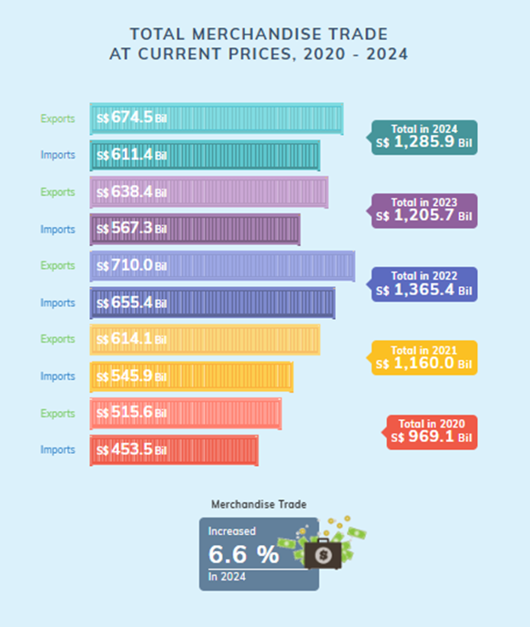
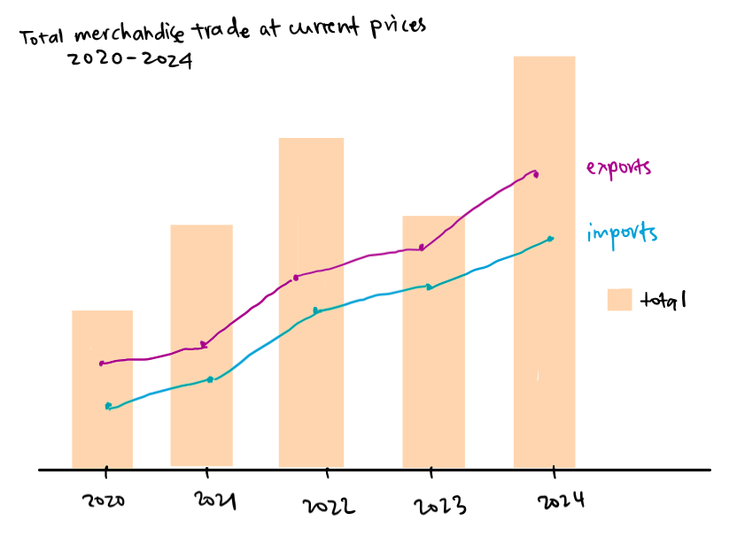
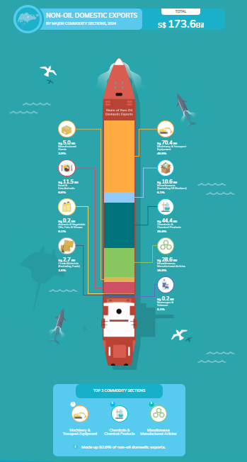
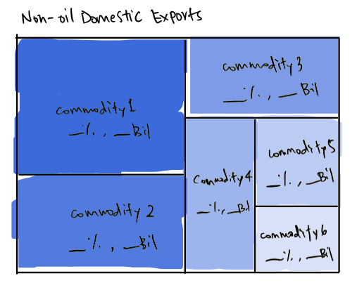
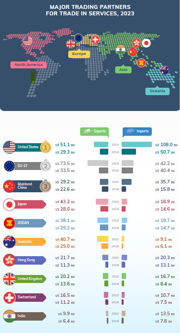
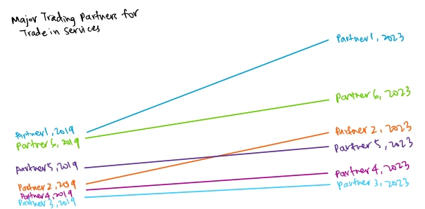

## 1. Overview

This exercise aims to improve data visualisations from the [Department of Statistics Singapore, DOS](#0) website, specifically the page on [Singapore's International Trade](https://www.singstat.gov.sg/modules/infographics/singapore-international-trade). Three data visualizations will be commented on, thereafter providing some sketches of its improvement and the final make-over visualization. The data will also then finally be analysed with time-series analysis and time-series forecasting methods. Appropriate R packages and data visualizations will be used.

## 2. Data and R packages

For this exercise, the following R packages will be loaded: **readxl**, **dplyr**, **ggplot2**, **lubridate**, **tidyr**, **ggrepel**, **treemap**, **plotly**, **CGPfunctions**, **patchwork**, **tibble**, **tsibble**, **feasts**.

::: {.callout-note title="Codes" collapse="true"}
```{r}
pacman::p_load(readxl, dplyr, ggplot2, lubridate, tidyr, ggrepel, treemap, plotly, CGPfunctions, patchwork, tibble, tsibble, feasts)
```
:::

## 3. Visualisations and its make-over

### 3.1. Makeover 1

#### 3.1.1. Pros and Cons of original chart

{fig-align="center" width="417"}

`Pros`

-   **Distinct colours chosen to separate data by year.**  Lighter shades are also consistently given to the *Exports* bar charts, making it easy to distinguish visually.

-   **Exact values are clearly indicated in the chart**, allowing readers to get an idea of the chart’s scale and know the exact values.

`Cons`

-   **Difficult to compare between imports and exports between the years.** The bar charts are stacked alternately by year. Imports should be compared with the other years’ imports, with the same applying to exports as well.

-   **Colour choice and differentiating data by years might not be useful.** Distinct colours can be limited and might not make sense if the dataset consisted of more years. White fonts against lighter colours might also prove difficult to see. Differentiating the data by years (by colours) does not hold any functionality as well and defeats the purpose of colour usage in this chart.

-   **Increased percentage of merchandise trade is not intuitive**. As the chart consists of data from 2020 to 2024, there should be an indication of the year that is chosen to be compared with such that there was a 6.6% increase relative to 2024.

`Potential Improvement`

-   **A line chart should be used** for clear visualisation of the change over the years, as well as a rough grasp of the change between the years. The absolute value should be made available when hovered over (interactive plot).

-   **Colours should be constant individually** for imports, exports, and the total per year respectively.

-   **Labels** will be individual for each line chart rather than via a legend.

#### 3.1.2. Sketch of make-over

{fig-align="center"}

#### 3.1.3. Final make-over

Firstly, all the relevant data will be picked out from the original dataset, consisting of *imports*, *exports*, and *re-exports*.

::: {.callout-note title="Codes" collapse="true"}
```{r}
imports <- read_xlsx("region_market.xlsx", sheet=2, skip=10, n_max=1)
exports <- read_xlsx("region_market.xlsx", sheet=3, skip=10, n_max=1)
re_exports <- read_xlsx("region_market.xlsx", sheet=4, skip=10, n_max=1)
```
:::

The data is then converted from wide to long (i.e. increasing the number of rows and decreasing the number of columns) using *pivot_longer()*, gaining *imports_longer*, *exports_longer* and *re_exports_longer*.

::: {.callout-note title="Codes" collapse="true"}
```{r}
#imports
imports_longer <- imports %>% 
  pivot_longer(cols= -'Data Series', names_to="Month_Year", values_to="Value") %>%
  mutate(Year = as.numeric(sub(" .*", "", Month_Year))) %>%
  filter(Year >= 2020 & Year <= 2024) %>%
  group_by(Year) %>%
  summarise(All_Imports = sum(Value, na.rm = TRUE))

#exports
exports_longer <- exports %>% 
  pivot_longer(cols= -'Data Series', names_to="Month_Year", values_to="Value") %>%
  mutate(Year = as.numeric(sub(" .*", "", Month_Year))) %>%
  filter(Year >= 2020 & Year <= 2024) %>%
  group_by(Year) %>%
  summarise(All_Exports = sum(Value, na.rm = TRUE))

#re-exports
re_exports_longer <- re_exports %>% 
  pivot_longer(cols= -'Data Series', names_to="Month_Year", values_to="Value") %>%
  mutate(Year = as.numeric(sub(" .*", "", Month_Year))) %>%
  filter(Year >= 2020 & Year <= 2024) %>%
  group_by(Year) %>%
  summarise(All_Re_Exports = sum(Value, na.rm = TRUE))
```
:::

Total values of exports (*exports* + *re_exports*) and overall total values (*imports* + *exports* + *re_exports*) are also calculated. Before plotting, *glimpse()* is used to confirm the data is the desired outcome.

::: {.callout-note title="Codes" collapse="true"}
```{r}
#combining exports
total_exports <- left_join(exports_longer, re_exports_longer, by='Year')
total_exports <- total_exports %>% mutate(Total_Exports = All_Exports + All_Re_Exports) 

#combining total
merchandise <- left_join(imports_longer, total_exports, by='Year')
merchandise <- merchandise %>% mutate(Total= All_Imports + Total_Exports)

glimpse(merchandise)
```
:::

Hover texts and line chart labels are first customized. Plotting imports and exports as line charts, while the total as a bar chart in a combined plot, the below is achieved.

::: {.callout-note title="Codes" collapse="true"}
```{r}
#| eval: false
#customise hover text
merchandise <- merchandise %>%
  mutate(Imports_Hover = paste0("Imports: ", round(All_Imports/1000, 1), "B"),
         Exports_Hover = paste0("Exports: ", round(Total_Exports/1000, 1), "B"),
         Total_Hover = paste0("Total Trade: ", round(Total/1000, 1), "B"))

#line chart labels
labels <- merchandise %>%
  filter(Year == 2024) %>%
  mutate(All_Imports_Label = paste0("Imports"),
         Total_Exports_Label = paste0("Exports"))

#plotting bar chart for total and 2 line charts for imports exports
p <- ggplot(merchandise, aes(x = Year)) +
  geom_bar(aes(y = Total/1000, fill = "Total Merchandise Trade", text = Total_Hover), stat='identity', alpha=0.4) +  
  geom_line(aes(y = All_Imports/1000), color='deepskyblue2', size=1, show.legend = FALSE) +  
  geom_line(aes(y = Total_Exports/1000), colour='blueviolet', size=1, show.legend = FALSE) +

#adding invisible points to attach hover text
  geom_point(aes(y = All_Imports/1000, text = Imports_Hover), color='deepskyblue2', size=3, alpha=0) +  
  geom_point(aes(y = Total_Exports/1000, text = Exports_Hover), colour='blueviolet', size=3, alpha=0) +

#adding line chart labels
  geom_text(data = labels, aes(x=Year+0.4, y = All_Imports/1000, label = All_Imports_Label), 
            color = 'deepskyblue2', hjust = 0, size = 3) +
  geom_text(data = labels, aes(x=Year+0.4, y = Total_Exports/1000, label = Total_Exports_Label), 
            color = 'blueviolet', hjust = 0, size = 3) +
  
#adding title and theme
  labs(title='Total Merchandise Trade\n2020-2024', x='Year', y='S$ (Bil)', fill="") +
  theme_minimal() +
  theme(legend.title = element_blank())

#interactive plot
ggplotly(p, tooltip = "text") %>%
  layout(hoverlabel = list(font = list(size = 12))) %>%
  config(displayModeBar = FALSE)
```
:::

```{r}
#| echo: false
#customise hover text
merchandise <- merchandise %>%
  mutate(Imports_Hover = paste0("Imports: ", round(All_Imports/1000, 1), "B"),
         Exports_Hover = paste0("Exports: ", round(Total_Exports/1000, 1), "B"),
         Total_Hover = paste0("Total Trade: ", round(Total/1000, 1), "B"))

#line chart labels
labels <- merchandise %>%
  filter(Year == 2024) %>%
  mutate(All_Imports_Label = paste0("Imports"),
         Total_Exports_Label = paste0("Exports"))

#plotting bar chart for total and 2 line charts for imports exports
p <- ggplot(merchandise, aes(x = Year)) +
  geom_bar(aes(y = Total/1000, fill = "Total Merchandise Trade", text = Total_Hover), stat='identity', alpha=0.4) +  
  geom_line(aes(y = All_Imports/1000), color='deepskyblue2', size=1, show.legend = FALSE) +  
  geom_line(aes(y = Total_Exports/1000), colour='blueviolet', size=1, show.legend = FALSE) +

#adding invisible points to attach hover text
  geom_point(aes(y = All_Imports/1000, text = Imports_Hover), color='deepskyblue2', size=3, alpha=0) +  
  geom_point(aes(y = Total_Exports/1000, text = Exports_Hover), colour='blueviolet', size=3, alpha=0) +

#adding line chart labels
  geom_text(data = labels, aes(x=Year+0.4, y = All_Imports/1000, label = All_Imports_Label), 
            color = 'deepskyblue2', hjust = 0, size = 3) +
  geom_text(data = labels, aes(x=Year+0.4, y = Total_Exports/1000, label = Total_Exports_Label), 
            color = 'blueviolet', hjust = 0, size = 3) +
  
#adding title and theme
  labs(title='Total Merchandise Trade\n2020-2024', x='Year', y='S$ (Bil)', fill="") +
  theme_minimal() +
  theme(legend.title = element_blank())

#interactive plot
ggplotly(p, tooltip = "text") %>%
  layout(hoverlabel = list(font = list(size = 12))) %>%
  config(displayModeBar = FALSE)
```

### 3.2. Makeover 2

{fig-align="center"}

#### 3.2.1. Pros and Cons of original chart

`Pros`

-   **A stacked bar chart is used to give an impression of proportionality**. These are further amplified by using different colours to separate the different commodity sections.

-   **Animated icons** are used to quickly capture the readers’ attention and give an idea of the section that is labelled without them having to read the words that are in smaller fonts.

-   **Clear and neat labels are used**, giving readers information in a manner that is easy to process and understand quickly.

`Cons`

-   **Unsorted data display**. The commodity section that has the largest proportion should be shown as the most obvious section, followed by the next. The lack of sorting thus required an additional segment at the bottom to indicate the top 3 commodity sections, which will be unnecessary if the chart could display that information.

-   **Unnecessary animations may be distracting**. The chart included some bird and dolphin animations that do not hold value in information dissemination but yet are placed quite closely to the data that is meant to be absorbed by readers. Despite the effort for this visualisation to be attention-catching, these redundant animations might prove to be counter-productive instead.

`Potential Improvement`

-   **Use a treemap graph**. Proportions can be seen more clearly and give some form of ranking to the data. Although areas can be difficult to process comparatively, a treemap is easier to visualize than a pie chart. The most contributing commodity section can also be highlighted immediately.
-   **Percentage and actual values to be shown**. This can provide more information to readers at a glance.
-   **A single color palette** will be chosen to allow clarity on the intensity of the chosen color. Intensity of the color can further emphasize on the commodity section of higher contribution.

#### 3.2.2. Sketch of make-over

{fig-align="center"}

#### 3.2.3. Final make-over

The correct dataset is first loaded into *commodity*.

::: {.callout-note title="Codes" collapse="true"}
```{r}
commodity <- read_xlsx("commodity_division.xlsx", sheet=2, skip=10, n_max=69)
```
:::

The required data is then selected (non-oil domestic exports only) and stored under *d_exports* before it is converted to the long format using *pivot_longer()*. They are finally grouped by their category types. *glimpse()* is used to ensure that the desired values are obtained accurately.

::: {.callout-note title="Codes" collapse="true"}
```{r}
d_exports <- commodity[47:55, c(1, 3:14)]

d_exports_longer <- d_exports %>% 
  pivot_longer(cols= -'Data Series', names_to="Month_Year", values_to="Value") %>%
  group_by(`Data Series`) %>%
  summarise(Total_Value = sum(Value, na.rm = TRUE))

glimpse(d_exports_longer)
```
:::

The sum is first stored in *total_sum* before the percentage can be derived. The actual values are also to be reflected in billions instead.

::: {.callout-note title="Codes" collapse="true"}
```{r}
total_sum <- sum(d_exports_longer$Total_Value)

d_exports_longer <- d_exports_longer %>%
  mutate(Percentage = (Total_Value / total_sum) * 100,
         Label = paste0(`Data Series`, "\n", #category name
                        "Value: ", round(Total_Value / 1e6, 1), "Bil\n", #value
                        "(", round(Percentage, 1), "%)")) #percentage
```
:::

With all the desired variables obtained, the treemap is finally plotted to achieve what is shown below.

::: {.callout-note title="Codes" collapse="true"}
```{r}
#| eval: false
#| fig-width: 14
#| fig-height: 10

treemap(d_exports_longer,
        index = "Label",
        vSize = "Total_Value",
        vColor = "Total_Value", 
        type = "value", 
        title = "Treemap of Non-Oil Domestic Exports 2024",
        palette = "Blues", 
        border.col = "black",  
        fontsize.labels = 14,
        align.labels = list(c("center", "center")))
```
:::

```{r}
#| echo: false
#| fig-width: 14
#| fig-height: 10

treemap(d_exports_longer,
        index = "Label",
        vSize = "Total_Value",
        vColor = "Total_Value", 
        type = "value", 
        title = "Treemap of Non-Oil Domestic Exports 2024",
        palette = "Blues", 
        border.col = "black",  
        fontsize.labels = 14,
        align.labels = list(c("center", "center")))
```

### 3.3. Makeover 3

{fig-align="center" width="434"}

#### 3.3.1. Pros and Cons of original chart

`Pros`

-   **Exact values are indicated** in the chart as the proportion of the bar chart can be difficult to visualize due to the small space that the bars are plotted.

-   **The top 3 countries are clearly labelled**. Clear identification of the top countries can be easily identified.

`Cons`

-   **Chart does not show rate of change** between the two years that are being compared. The rate of change between the countries thus cannot be compared easily.

-   **It is not clearly stated how the countries are ranked**. As the countries show imports and exports of 2019 and 2023, they could be ranked by either variable of either year, or even by the rate of change.

-   **It is difficult to compare the differences between the countries**. They are not placed side by side for easy visual comparison and the differences could be more clearly portrayed.

-   **Inconsistency in the grouping type** whereby there are some countries (e.g. Switzerland, Japan) while others consist of a group of countries (e.g. ASEAN, United Kingdom). However, this might be acceptable since the chart is stated as "Major Trading Partners", which does not specifically limit the grouping type.

`Potential Improvements`

-   **Use a slopegraph instead**. A slopegraph can clearly show the rate of change between 2019 and 2023. The data points of the different countries are also plotted on the same graph, showing their position relative to the others. This will improve on the ease of comparison between different countries for the data points as well as the rate of change of this period.

#### 3.3.2. Sketch of make-over

{fig-align="center"}

#### 3.3.3. Final make-over

[Imports of Services by Major Trading Partners](https://tablebuilder.singstat.gov.sg/table/TS/M060211) and [Imports of Services by Major Trading Partners](https://tablebuilder.singstat.gov.sg/table/TS/M060201) datasets are loaded into *s_imports* and *s_exports* respectively.

::: {.callout-note title="Codes" collapse="true"}
```{r}
s_imports <- read_xlsx("service_imports.xlsx", skip=10, n_max=69)
s_exports <- read_xlsx("service_exports.xlsx", skip=10, n_max=69)
```
:::

Since only year 2019 and 2023 are needed, we will filter out the necessary columns.

::: {.callout-note title="Codes" collapse="true"}
```{r}
s_imports <- s_imports[c(1,6,2)]
s_exports <- s_exports[c(1,6,2)]
```
:::

As only the major trading partners are required, the data is first sorted by their values in 2023 in descending order with only the top 10 being filtered. These are then stored in *top_10_imports* and *top_10_exports* accordingly.

::: {.callout-note title="Codes" collapse="true"}
```{r}
top_10_imports <- s_imports %>% 
  arrange(desc(`2023`)) %>%
  slice_head(n = 10)

top_10_exports <- s_exports %>%
  arrange(desc(`2023`)) %>%
  slice_head(n = 10)
```
:::

The data is then converted to long format, and for 2019 and 2023 to be under the column *Year*, which is of numeric data type.

::: {.callout-note title="Codes" collapse="true"}
```{r}
top_10_imports_long <- top_10_imports %>%
  pivot_longer(cols = starts_with("20"), names_to = "Year", values_to = "Value")

top_10_exports_long <- top_10_exports %>%
  pivot_longer(cols = starts_with("20"), names_to = "Year", values_to = "Value")
```
:::

Plotting the 2 plots on slopegraphs, the below will be obtained:

::: {.callout-note title="Codes" collapse="true"}
```{r}
#| eval: false
#| fig-height: 14 
p1 <- newggslopegraph(
  dataframe = top_10_imports_long,
  Times = Year,
  Measurement = Value,
  Grouping = `Data Series`,
  Title = "Trade Value Changes (2019 and 2023)",
  SubTitle = "Imports of Services by Major Trading Partners (Top 10)",
  Caption = "Prepared by: Zanelle Lee",
  LineThickness = 1.1 
)

p2 <- newggslopegraph(
  dataframe = top_10_exports_long,
  Times = Year,
  Measurement = Value,
  Grouping = `Data Series`,
  Title = "Trade Value Changes (2019 and 2023)",
  SubTitle = "Exports of Services by Major Trading Partners (Top 10)",
  Caption = "Prepared by: Zanelle Lee",
  LineThickness = 1.1 
)

p1 / p2
```
:::

```{r}
#| echo: false
#| fig-height: 14 
p1 <- newggslopegraph(
  dataframe = top_10_imports_long,
  Times = Year,
  Measurement = Value,
  Grouping = `Data Series`,
  Title = "Trade Value Changes (2019 and 2023)",
  SubTitle = "Imports of Services by Major Trading Partners (Top 10)",
  Caption = "Prepared by: Zanelle Lee",
  LineThickness = 1.1 
)

p2 <- newggslopegraph(
  dataframe = top_10_exports_long,
  Times = Year,
  Measurement = Value,
  Grouping = `Data Series`,
  Title = "Trade Value Changes (2019 and 2023)",
  SubTitle = "Exports of Services by Major Trading Partners (Top 10)",
  Caption = "Prepared by: Zanelle Lee",
  LineThickness = 1.1 
)

p1 / p2
```

## 4. Time-series analysis

The relevant data is loaded into *t_imports*. The imports sheet is used for this time series segment, thus only sheet T1 will be read and loaded.

::: {.callout-note title="Codes" collapse="true"}
```{r}
t_imports <- read_xlsx("region_market.xlsx", sheet=2, skip=10, n_max=161)
```
:::

The data is then transposed by *as.data.frame(t(t_imports))*.

::: {.callout-note title="Codes" collapse="true"}
```{r}
t_imports <- as.data.frame(t(t_imports))
```
:::

The first rows are made to be column names and duplicates are removed. The row names are then changed to values using *rownames_to_column()*.

::: {.callout-note title="Codes" collapse="true"}
```{r}
#make first row become column names
colnames(t_imports) <- as.character(unlist(t_imports[1, ]))

#remove first row to prevent duplicates
t_imports <- t_imports[-1, ]

#making row name into values
t_imports <- t_imports %>%
  rownames_to_column(var = "Month_Year")
```
:::

The Month_Year is changed to a date format before rearranging the data frame to have the *Date* as the first column.

::: {.callout-note title="Codes" collapse="true"}
```{r}
#changing date format
t_imports <- t_imports %>% 
  mutate(Date = parse_date_time(Month_Year, orders = "ym")) %>%
  mutate(Date = as.Date(Date))

#rearranging dataset
t_imports <- t_imports[c(162, 3:161)]
```
:::

After preparing the data, it is ready to be converted to a *tsibble* object for time-series analysis.

::: {.callout-note title="Codes" collapse="true"}
```{r}
ts_imports <- t_imports %>% 
  mutate(Month = yearmonth(`Date`)) %>%
  select(-Date) %>%
  as_tsibble(index=`Month`)

ts_imports <- ts_imports[c(160, 1:159)]
```
:::

*pivot_longer()* is used to convert the data to a long format, and changing all *Values* to numeric.

::: {.callout-note title="Codes" collapse="true"}
```{r}
t_imports_longer <- t_imports %>% 
  pivot_longer(cols= -Date, names_to="Region", values_to="Value") %>%
  filter(Region %in% c("America","Asia","Europe","Oceania","Africa"))

t_imports_longer$Value <- as.numeric(t_imports_longer$Value)
```
:::

### 4.1. Multiple time-series data

All regions are plotted together and separately in the charts below.

::: {.callout-note title="Codes" collapse="true"}
```{r}
#| eval: false

#All
t_imports_longer %>%
  ggplot(aes(x = `Date`, 
             y = Value,
             color = Region))+
  geom_line(size = 0.5)

#Africa
t_imports_longer %>%
  filter(Region == "Africa") %>%
  ggplot(aes(x = `Date`, 
             y = Value))+
  geom_line(size = 0.5)

#America
t_imports_longer %>%
  filter(Region == "America") %>%
  ggplot(aes(x = `Date`, 
             y = Value))+
  geom_line(size = 0.5)

#Asia
t_imports_longer %>%
  filter(Region == "Asia") %>%
  ggplot(aes(x = `Date`, 
             y = Value))+
  geom_line(size = 0.5)

#Europe
t_imports_longer %>%
  filter(Region == "Europe") %>%
  ggplot(aes(x = `Date`, 
             y = Value))+
  geom_line(size = 0.5)

#Oceania
t_imports_longer %>%
  filter(Region == "Oceania") %>%
  ggplot(aes(x = `Date`, 
             y = Value))+
  geom_line(size = 0.5)

```
:::

::: panel-tabset
## All

```{r}
#| echo: false
t_imports_longer %>%
  ggplot(aes(x = `Date`, 
             y = Value,
             color = Region))+
  geom_line(size = 0.5)
```

## Africa

```{r}
#| echo: false
t_imports_longer %>%
  filter(Region == "Africa") %>%
  ggplot(aes(x = `Date`, 
             y = Value))+
  geom_line(size = 0.5)
```

## America

```{r}
#| echo: false
t_imports_longer %>%
  filter(Region == "America") %>%
  ggplot(aes(x = `Date`, 
             y = Value))+
  geom_line(size = 0.5)
```

## Asia

```{r}
#| echo: false
t_imports_longer %>%
  filter(Region == "Asia") %>%
  ggplot(aes(x = `Date`, 
             y = Value))+
  geom_line(size = 0.5)
```

## Europe

```{r}
#| echo: false
t_imports_longer %>%
  filter(Region == "Europe") %>%
  ggplot(aes(x = `Date`, 
             y = Value))+
  geom_line(size = 0.5)
```

## Oceania

```{r}
#| echo: false
t_imports_longer %>%
  filter(Region == "Oceania") %>%
  ggplot(aes(x = `Date`, 
             y = Value))+
  geom_line(size = 0.5)
```
:::

These data can also be seen in one view using *facet_wrap()*.

::: {.callout-note title="Codes" collapse="true"}
```{r}
#| eval: false
ggplot(data = t_imports_longer, 
       aes(x = `Date`, 
           y = Value))+
  geom_line(size = 0.5) +
  facet_wrap(~ Region,
             ncol = 2,
             scales = "free_y")
```
:::

```{r}
#| echo: false
ggplot(data = t_imports_longer, 
       aes(x = `Date`, 
           y = Value))+
  geom_line(size = 0.5) +
  facet_wrap(~ Region,
             ncol = 2,
             scales = "free_y")
```

Generally all plots show increasing trade values, with a long-term upward trend. Trade can be said to be consistently growing, especially in the last decade. Sharpest growths are seen in Africa, America and Asia, with Europe having moderate growth and Oceania experiencing volatility. These shifts could possibly be due to recovery post COVID-19 pandemic. More fluctuations are noted in regions like Africa and Oceania while America and Asia have more stable growth.

### 4.2. Seasonality Plots

Data is converted to long format via *pivot_longer()*, and data type of *Value* is changed to numeric.

::: {.callout-note title="Codes" collapse="true"}
```{r}
ts_imports_longer <- ts_imports %>%
  pivot_longer(cols = -Month,
               names_to = "Region",
               values_to = "Value") %>%
  filter(Region %in% c("America","Asia","Europe","Oceania","Africa"))

ts_imports_longer$Value <- as.numeric(ts_imports_longer$Value)
```
:::

#### 4.2.1. Seasonal Plot

*gg_season()* is used to plot the seasonal plots of the different regions.

::: {.callout-note title="Codes" collapse="true"}
```{r}
#| eval: false
ts_imports_longer %>%
  gg_season(Value)
```
:::

```{r}
#| echo: false
ts_imports_longer %>%
  gg_season(Value)
```

Higher trade volumes in recent years (pink and purple lines are noted to have higher values) as compared to those in earlier years (e.g. orange and yellow lines) in this plot further supports that trade has grown over time (upward trend). Seasonality might be present. America and Asia show some distinct peaks in certain months while fluctuations seem more present in Africa and Oceania.

::: {.callout-note title="Codes" collapse="true"}
```{r}
#| eval: false
ts_imports_longer %>%
  autoplot(Value) +
  facet_grid(Region ~ ., scales = "free_y")
```
:::

```{r}
#| echo: false
ts_imports_longer %>%
  autoplot(Value) +
  facet_grid(Region ~ ., scales = "free_y")
```

This multiple time-series plot supports the insights from the earlier plots but also indicate that different regions might require different models for forecasting due to the varying historical behaviour.

#### 4.2.2. Cycle Plot

*gg_subseries()* is used to plot cycle plots that might reveal trend and seasonal patterns.

::: {.callout-note title="Codes" collapse="true"}
```{r}
#| eval: false
ts_imports_longer %>%
  gg_subseries(Value)
```
:::

```{r}
#| echo: false
ts_imports_longer %>%
  gg_subseries(Value)
```

Earlier months in the year seem to have slower growth across all regions while trade values increase towards the later half of the year. Some months may also exhibit steeper upward trends than others.

### 4.3. Time-series Decomposition

Decomposing time series data can allow for identification of trends and seasonality, helping forecast future values. Noise can be removed for easier detection of anomalies and structural changes. Forecasting models can also be improved.

#### 4.3.1. ACF Plot

Autocorrelation Function (ACF) plots show how strongly past observations (lags) influence future values. Higher bars indicate stronger relationships with the past observation. Blue dotted lines indicate the confidence intervals and help determine which correlations are statistically significant. Spikes at seasonal lags (e.g. 12 or 24) indicate presence of strong seasonality.

::: {.callout-note title="Codes" collapse="true"}
```{r}
#| eval: false
ts_imports_longer %>%
  ACF(Value) %>%
  autoplot()
```
:::

```{r}
#| echo: false
ts_imports_longer %>%
  ACF(Value) %>%
  autoplot()
```

The ACF plot shows that there is a slow decay across all regions and the autocorrelation values remain statistically significant for many lags (exceed the blue dotted lines that indicate confidence intervals). This indicates that the time series is persistent and past values continue to influence future values over extended periods.

However, there seem to be no strong seasonal peaks (no spikes at specific lags e.g. 12 for yearly seasonality) and the decline of the ACF is gradual (non-stationary data). Seasonality might not be a dominant factor.

An ARIMA model might be suitable.

#### 4.3.2. PACF Plot

Partial Autocorrelation Function (PACF) plots measure the direct relationship between an observation and its lagged values while removing the effect of intermediate lags. True dependencies between time points can be seen.

::: {.callout-note title="Codes" collapse="true"}
```{r}
#| eval: false
ts_imports_longer %>%
  PACF(Value) %>%
  autoplot()
```
:::

```{r}
#| echo: false
ts_imports_longer %>%
  PACF(Value) %>%
  autoplot()
```

There is significant lag at lag=1 across all regions, indicating a strong correlation with the previous month's value. There is also a rapid decay after the first few lags (Asia's one being more drastic) which shows that only more recent past values have a significant impact.

#### 4.3.3. Composite Plot

To view a composite plot of a region, *gg_tsdisplay()* can also be used to show the original line graph on the top pane, followed by the ACF plot on the bottom left and seasonal plot on the right. *Asia* will be filtered and its composite plot shown.

::: {.callout-note title="Codes" collapse="true"}
```{r}
#| eval: false
ts_imports_longer %>%
  filter(`Region` == "Asia") %>%
  gg_tsdisplay(Value)
```
:::

```{r}
#| echo: false
ts_imports_longer %>%
  filter(`Region` == "Asia") %>%
  gg_tsdisplay(Value)
```

#### 4.3.4. STL diagnostics

STL (Seasonal-Trend_Loess) Diagnostic refers to the analysis of time series data after STL decomposition The data is evaluated by breaking it into three key components:

1.  Trend - long-term movements

2.  Seasonality -repeated patterns at fixed intervals

3.  Remainder - irregular variations and noise after removing Trend and Seasonality

Filtering *Asia*, the plot below is obtained.

::: {.callout-note title="Codes" collapse="true"}
```{r}
#| eval: false
ts_imports_longer %>%
  filter(`Region` == "Asia") %>%
  model(stl = STL(Value)) %>%
  components() %>%
  autoplot()
```
:::

```{r}
#| echo: false
ts_imports_longer %>%
  filter(`Region` == "Asia") %>%
  model(stl = STL(Value)) %>%
  components() %>%
  autoplot()
```

It is important to note that the scales are different for the different segments, with the grey bars on the left as a scale reference relative to the other segments. It is seen that there is a general upward trend over the years for *Asia*, and there is some seasonality. Removing both trend and seasonality, the remainder is just noise, and does not have any pattern.
