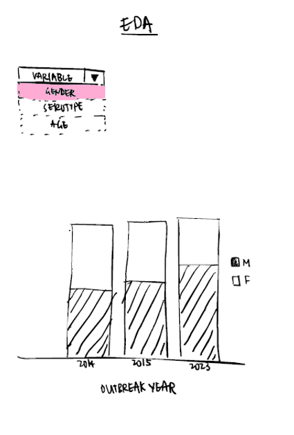
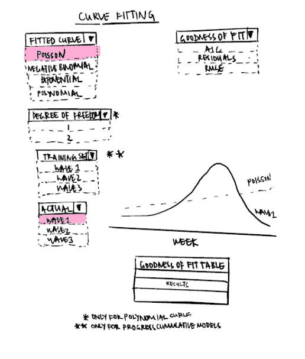

# Dengue in Taiwan

# 1. Overview

# 2. Loading R Packages and Data Preparation

First, we load the appropriate R packages that are necessary for the exploration of the dataset, as well as for its analysis and time series usage. In this segment, we will be loading **tidyverse**, **MASS**, **mgcv**, and **Metrics**.

```{r}
#| code-fold: true
#| code-summary: "Show Code for loading R packages"

pacman::p_load(tidyverse, plotly, MASS, mgcv, Metrics, gt)
```

The dataset is loaded into *dengue_daily*, and *summary()* is used to get a rough idea on the dataset and its variables.

```{r}
#| code-fold: true
#| code-summary: "Show Code for loading dataset"

dengue_daily <- read_csv("Dengue_Daily.csv")
summary(dengue_daily)
```

As this is a Taiwan dataset, it is not surprising that most of the data is recorded in Mandarin. For easier referencing and usage of the dataset, the column names are translated to English.

```{r}
#| code-fold: true
#| code-summary: "Show Code for columns translation"

colnames(dengue_daily) <- c("Onset_Date", "Case_Classification_Date", "Reporting_Date", "Gender", 
                  "Age_Group", "Residential_County_City", "Residential_Town_District", 
                  "Residential_Village", "Smallest_Statistical_Area", "X_coord", 
                  "Y_coord", "Primary_Statistical_Area", "Secondary_Statistical_Area",
                  "Infection_County_City", "Infection_Town_District", "Infection_Village",
                  "Imported_Case", "Infection_Country", "Confirmed_Cases", 
                  "Residential_Village_Code", "Infection_Village_Code", "Serotype", 
                  "MOI_Residential_County_Code", "MOI_Residential_Town_Code", 
                  "MOI_Infection_County_Code", "MOI_Infection_Town_Code")
```

Looking through the variables, we realized that *Confirmed_Cases* have 2 rows that consist of count "2" instead of "1" like all the other rows. Thus, we duplicate these rows to the number of count (i.e. 2) and change the count to "1". The code will work for rows with number of count more than 2 as well. This column will then not be necessary for future steps.

```{r}
#| code-fold: true
#| code-summary: "Show Code for amending Confirmed_Cases column"

dengue_daily <- dengue_daily %>%
  rowwise() %>%   
  mutate(Confirmed_Cases = list(rep(1, Confirmed_Cases))) %>%   
  unnest(Confirmed_Cases)

# to check if done correctly, uncomment below line code
#dengue_daily %>% filter(Confirmed_Cases != 1)
```

The relevant columns are then selected, and these include *Onset_Date*, *Gender*, *Age_Group*, *Residential_County_City*, *Residential_Town_District*, *X_coord*, *Y_coord*, *Imported_Case*, *Serotype*, *MOI_Residential_County_Code*, *MOI_Residential_Town_Code*.

```{r}
#| code-fold: true
#| code-summary: "Show Code for columns selection"

dengue_daily <- dengue_daily %>% 
    dplyr::select(Onset_Date, Gender, Age_Group, Residential_County_City, 
           Residential_Town_District, X_coord, Y_coord, Imported_Case, 
           Serotype, MOI_Residential_County_Code, MOI_Residential_Town_Code)
```

The data was also further scrutinized. The following amendments were made to make the dataset easier to reference and work with:

1.  Translating *Residential_County_City*, *Imported_Case* and *Serotype* into English. This was done using [Google Translate](https://translate.google.com.sg/).
2.  Creating a variable *Onset_Epiweek* from *Onset_Date*.
3.  Changing 1 row consisting of *Gender* "U" to "M" instead. The row contains usable data in the other columns and does not need to be removed from the dataset. The gender is then changed to "M" for convenience. This should be noted when *Gender* is being studied, although it should not vary greatly due to the large dataset.
4.  Padding *MOI_Residential_County_Code* with "0" to its right to make a 5 digit county code.
5.  Binning ages 0-4 and amending the format of those in ages 5-9 (originally reflected as a date format). The age groups are then sorted in an ascending order.

```{r}
#| code-fold: true
#| code-summary: "Show Code for further preparation of data"

dengue_daily <- dengue_daily %>%
  mutate(Residential_County_City = recode(Residential_County_City,
                                      "屏東縣" = "Pingtung County",
                                      "宜蘭縣" = "Yilan County",
                                      "高雄市" = "Kaohsiung City",
                                      "桃園市" = "Taoyuan City",
                                      "新北市" = "New Taipei City",
                                      "台北市" = "Taipei City",
                                      "台南市" = "Tainan City",
                                      "新竹縣" = "Hsinchu County",
                                      "南投縣" = "Nantou County",
                                      "台中市" = "Taichung City",
                                      "新竹市" = "Hsinchu City",
                                      "雲林縣" = "Yunlin County",
                                      "彰化縣" = "Changhua County",
                                      "花蓮縣" = "Hualien County",
                                      "台東縣" = "Taitung County",
                                      "嘉義縣" = "Chiayi County",
                                      "嘉義市" = "Chiayi City",
                                      "基隆市" = "Keelung City",
                                      "苗栗縣" = "Miaoli County",
                                      "澎湖縣" = "Penghu County",
                                      "連江縣" = "Lianjiang County",
                                      "金門縣" = "Kinmen County"),
         Onset_Epiweek = epiweek(Onset_Date),
         Gender = recode(Gender, "U" = "M"),
Imported_Case = recode(Imported_Case, "是" = "Yes", 
                       "否" = "No"),
Serotype = recode(Serotype, "第一型" = "Type 1",
                  "第二型" = "Type 2",
                  "第三型" = "Type 3",
                  "第四型" = "Type 4"),
MOI_Residential_County_Code = 
               str_pad(MOI_Residential_County_Code, width = 5, 
                       side = "right", pad = "0"),
Age_Group = ifelse(Age_Group %in% c("0", "1", "2", "3", "4"), "0-4", Age_Group),
         Age_Group = factor(Age_Group, levels = c("0-4", "5-9", 
                                                  sort(unique(Age_Group[
                                                      Age_Group != "0-4" & Age_Group != "5-9"]
                                                      )))))
```

# 3. EDA

## 3.1. Outbreak Years

As we are focusing on the disease outbreak periods, we will first need to isolate the time period where this outbreak occurs. The data will also be studied by weeks, rather than days.

```{r}
#| code-fold: true
#| code-summary: "Show Code for obtaining number of cases per week"

dengue_daily$Onset_Date <- as.Date(dengue_daily$Onset_Date)

weekly_cases <- dengue_daily %>%
  mutate(week = floor_date(Onset_Date, "week")) %>%
  group_by(week) %>%
  summarise(cases = n())
```

There are 3 outbreak periods namely in 2014, 2015 and 2023. These will also be referred to as *Wave 1*, *Wave 2* and *Wave 3* interchangeably. The start and end dates of these outbreak periods and loaded into *wave1_start*, *wave1_end*, *wave2_start*, *wave2_end*, *wave3_start* and *wave3_end* respectively. The number of cases from the entire dataset is aggregated by weeks are plotted, with the 3 outbreak periods. The 3 outbreak periods are also highlighted.

```{r}
#| code-fold: true
#| code-summary: "Show Code for plotting Weekly Dengue Cases"

wave1_start <- as.Date("2014-05-11")
wave1_end <- as.Date("2015-01-25")

wave2_start <- as.Date("2015-05-24")
wave2_end <- as.Date("2016-02-14")

wave3_start <- as.Date("2023-05-07")
wave3_end <- as.Date("2024-02-04")

dengue_daily <- dengue_daily %>%
  mutate(Wave = case_when(
    Onset_Date >= wave1_start & Onset_Date <= wave1_end ~ "Wave 1",
    Onset_Date >= wave2_start & Onset_Date <= wave2_end ~ "Wave 2",
    Onset_Date >= wave3_start & Onset_Date <= wave3_end ~ "Wave 3",
    TRUE ~ NA_character_
  ))

ggplot(weekly_cases, aes(x = week, y = cases)) +
  geom_line(color = "black") +
#wave1 reference  
  geom_vline(xintercept = c(wave1_start, wave1_end), color = "skyblue4", linetype = "dashed") +
  geom_rect(aes(xmin = wave1_start, xmax = wave1_end,
                ymin = -Inf, ymax = Inf),
            fill = "skyblue4", alpha = 0.008) +
#wave2 reference
  geom_vline(xintercept = c(wave2_start, wave2_end), color = "indianred", linetype = "dashed") +
  geom_rect(aes(xmin = wave2_start, xmax = wave2_end,
                ymin = -Inf, ymax = Inf),
            fill = "indianred", alpha = 0.008) +
#wave3 reference
  geom_vline(xintercept = c(wave3_start, wave3_end), color = "olivedrab4", linetype = "dashed") +
  geom_rect(aes(xmin = wave3_start, xmax = wave3_end,
                ymin = -Inf, ymax = Inf),
            fill = "olivedrab4", alpha = 0.008) +
  
  labs(title = "Weekly Dengue Cases", x = "Week", y = "Cases")
```

The outbreak periods are then loaded into its respective variable - *wave1*, *wave2* and *wave3*.

```{r}
#| code-fold: true
#| code-summary: "Show Code for obtaining outbreak periods"

wave1 <- weekly_cases %>%
  filter(week >= wave1_start & week <= wave1_end)

wave2 <- weekly_cases %>%
  filter(week >= wave2_start & week <= wave2_end)

wave3 <- weekly_cases %>%
  filter(week >= wave3_start & week <= wave3_end)
```

To properly compare the shape of the graph, the 3 waves will have to share the same axis. Since the outbreak periods occur almost in the same months in the 3 different years, we will plot the graphs according to months instead.

```{r}
#| code-fold: true
#| code-summary: "Show Code for the 3 waves being plotted on same axis (Month)"

wave1 <- wave1 %>% mutate(month_day = format(week, "%m-%d"), Outbreak_Year ="2014", aligned_date = if_else(month(week) <= 3,
                           as.Date(paste0("2024-", month_day)),
                           as.Date(paste0("2023-", month_day)))
  )
wave2 <- wave2 %>% mutate(month_day = format(week, "%m-%d"), Outbreak_Year ="2015", aligned_date = if_else(month(week) <= 3,
                           as.Date(paste0("2024-", month_day)),
                           as.Date(paste0("2023-", month_day)))
  )
wave3 <- wave3 %>% mutate(month_day = format(week, "%m-%d"), Outbreak_Year ="2023", aligned_date = if_else(month(week) <= 3,
                           as.Date(paste0("2024-", month_day)),
                           as.Date(paste0("2023-", month_day)))
  )

# Step 2: Combine all into one dataset
all_waves <- bind_rows(wave1, wave2, wave3)

# Step 3: Plot
ggplot(all_waves, aes(x = aligned_date, y = cases, color = Outbreak_Year)) +
  geom_line(size = 1) +
  scale_x_date(date_labels = "%b",
  breaks = seq(as.Date("2023-05-01"), as.Date("2024-03-01"), by = "1 month"),
    limits = c(as.Date("2023-05-01"), as.Date("2024-03-28"))
  ) +
  labs(title = "Dengue Outbreak Comparison (2014, 2015, 2023)",
       x = "Week", y = "Number of cases", color = "Year of Outbreak") +
  scale_color_manual(values = c("2014" = "skyblue", 
                                "2015" = "indianred", 
                                "2023" = "olivedrab4")) +
  theme_minimal()
```

## 3.2. Proportions in Outbreak Years

To gain a better understanding of the dataset, we further study the ancillary data surrounding the cases during outbreak period.

### 3.2.1. Gender

The gender proportion is almost equal across both genders.

```{r}
#| code-fold: true
#| code-summary: "Show Code plotting Gender proportion"


dengue_daily %>% 
  filter(!is.na(Wave)) %>%
  group_by(Wave, Gender) %>%
  summarise(count = n(), .groups = "drop") %>%
  group_by(Wave) %>%
  mutate(prop = count / sum(count)) %>%
  ggplot(aes(x = Wave, y = prop, fill = Gender)) +
  geom_col(position = "fill") +
  scale_x_discrete(labels = c(
    "Wave 1" = "2014 Outbreak Wave",
    "Wave 2" = "2015 Outbreak Wave",
    "Wave 3" = "2023 Outbreak Wave"
  )) +
  labs(title = "Gender Proportion by Outbreak Year", y = "Proportion", x = "Year of Outbreak") +
  scale_y_continuous(labels = scales::percent) +
  theme_minimal() +
    scale_fill_brewer(palette="Pastel1")
```

### 3.2.2. Imported Cases

There are significantly more local cases than foreign ones during outbreak periods.

```{r}
#| code-fold: true
#| code-summary: "Show Code plotting Imported Cases proportion"

dengue_daily %>%
  filter(!is.na(Wave)) %>%
  group_by(Wave, Imported_Case) %>%
  summarise(count = n(), .groups = "drop") %>%
  group_by(Wave) %>%
  mutate(prop = count / sum(count)) %>%
  ggplot(aes(x = Wave, y = prop, fill = Imported_Case)) +
  geom_col(position = "fill") +
  scale_x_discrete(labels = c(
    "Wave 1" = "2014 Outbreak Wave",
    "Wave 2" = "2015 Outbreak Wave",
    "Wave 3" = "2023 Outbreak Wave"
  )) +
  labs(title = "Imported Case Proportion by Outbreak Year", y = "Proportion", x = "Outbreak Year") +
  scale_y_continuous(labels = scales::percent) +
  theme_minimal() +
  scale_fill_brewer(palette="Pastel1")
```

### 3.2.3. Age Group

Generally, there are more older people that are infected during outbreak periods.

```{r}
#| code-fold: true
#| code-summary: "Show Code plotting Age Group proportion"

dengue_daily %>%
  filter(!is.na(Wave)) %>%
  group_by(Wave, Age_Group) %>%
  summarise(count = n(), .groups = "drop") %>%
  group_by(Wave) %>%
  mutate(prop = count / sum(count)) %>%
  ggplot(aes(x = Wave, y = prop, fill = Age_Group)) +
  geom_col(position = "fill") +
  scale_x_discrete(labels = c(
    "Wave 1" = "2014 Outbreak Wave",
    "Wave 2" = "2015 Outbreak Wave",
    "Wave 3" = "2023 Outbreak Wave"
  )) +
  labs(title = "Age Group Proportion by Outbreak Year", y = "Proportion", x = "Outbreak Year") +
  scale_y_continuous(labels = scales::percent) +
  theme_minimal() +
  scale_fill_manual(values = c("mistyrose", "darkcyan", "snow3", "orchid4", "royalblue", "burlywood2", "maroon", "cadetblue", "lightsalmon3", "lightpink1", "aquamarine4", "plum4", "indianred", "lightsalmon", "antiquewhite"))
```

### 3.2.4. Serotype

There are many rows with NA values. However, the rows with values are all plotted, and it can be seen that the most common strains are Type 1 and Type 2.

```{r}
#| code-fold: true
#| code-summary: "Show Code plotting Serotype proportion"


dengue_daily %>%
  filter(!is.na(Wave)) %>%
  filter(!is.na(Serotype)) %>%
  group_by(Wave, Serotype) %>%
  summarise(count = n(), .groups = "drop") %>%
  group_by(Wave) %>%
  mutate(prop = count / sum(count)) %>%
  ggplot(aes(x = Wave, y = prop, fill = Serotype)) +
  geom_col(position = "fill") +
  scale_x_discrete(labels = c(
    "Wave 1" = "2014 Outbreak Wave",
    "Wave 2" = "2015 Outbreak Wave",
    "Wave 3" = "2023 Outbreak Wave"
  )) +
  labs(title = "Serotype Proportion by Outbreak Year", y = "Proportion", x = "Outbreak Year") +
  scale_y_continuous(labels = scales::percent) +
  theme_minimal() +
  scale_fill_brewer(palette="Pastel1")
```

# 4. Week-based Curve Fitting

Before starting on model comparison, we must first decide on the types of model we want to include in our comparison. Here is a quick summary of the curves that will be fitted.

```{r}
#| code-fold: true
#| code-summary: "Show Code for model summaries"


table_data <- tibble(
  Model = c("Poisson", "Negative Binomial", "Exponential", "GAM", "Polynomial", "Lognormal", "Gamma"),
  `Best For` = c(
    "Count data with equal mean/variance",
    "Overdispersed count data",
    "Early outbreak exponential growth",
    "Complex trends and multi-peak waves",
    "Epidemic waves (with right degree)",
    "Cumulative or right-skewed data",
    "Skewed continuous outcome (e.g., duration)"
  ),
  Overdispersion = c("No", "Yes", "No", "Yes", "No", "Yes", "Yes"),
  Flexibility = c("Low", "Moderate", "Low", "Very High", "High", "Moderate", "Moderate"),
  Interpretability = c("High", "High", "High", "Moderate", "Low", "Low", "Low"),
  `Overfitting Risk` = c("Low", "Medium", "Low", "High", "High", "Medium", "Medium"),
  Remarks = c(
    "Fails with overdispersion",
    "Good for noisy data",
    "Fits only early phase",
    "Flexible, needs tuning",
    "Prone to overfit with high degree",
    "Good for wave shapes",
    "Good for cumulative modeling"
  )
)


color_overdispersion <- function(x) ifelse(x == "Yes", "lightgreen", "tomato")
color_flexibility <- function(x) case_when(
  x == "Low" ~ "#f4cccc",
  x == "Moderate" ~ "#fce5cd",
  x == "High" ~ "#d9ead3",
  x == "Very High" ~ "#b6d7a8",
  TRUE ~ NA_character_
)
color_interpretability <- function(x) case_when(
  x == "Low" ~ "#f4cccc",
  x == "Moderate" ~ "#fff2cc",
  x == "High" ~ "#b6d7a8",
  TRUE ~ NA_character_
)
color_overfitting <- function(x) case_when(
  x == "Low" ~ "#b6d7a8",
  x == "Medium" ~ "#ffe599",
  x == "High" ~ "#f4cccc",
  TRUE ~ NA_character_
)


table_data %>%
  gt() %>%
  tab_header(title = "Comparison of Curve Fitting Models") %>%
  data_color(columns = c(Overdispersion), fn = color_overdispersion) %>%
  data_color(columns = c(Flexibility), fn = color_flexibility) %>%
  data_color(columns = c(Interpretability), fn = color_interpretability) %>%
  data_color(columns = c(`Overfitting Risk`), fn = color_overfitting)

```

## 4.1. Outbreak Year 2014

```{r}
#| code-fold: true
#| code-summary: "Show Code to obtain Week Index"

wave1 <- wave1 %>%   
  arrange(week) %>%   
  mutate(week_index = row_number())
```

### 4.1.1. Model Comparison

```{r}
#| code-fold: true
#| code-summary: "Show Code for different models"
# Poisson model
poisson_model1 <- glm(cases ~ week_index, family = "poisson", data = wave1)

# Negative Binomial model
nb_model1 <- glm.nb(cases ~ week_index, data = wave1)

# Exponential model (linear model on log scale)
exp_model1 <- glm(log(cases + 1) ~ week_index, family = gaussian(), data = wave1)

# Fit the GAM model 
gam_model1 <- gam(cases ~ s(week_index), family = poisson(), data = wave1)

# Fit 2nd-degree polynomial Poisson regression
poly_model1 <- glm(cases ~ poly(week_index, 2), family = poisson(), data = wave1)

# Log-Normal (fit on log-transformed cases + 1 to avoid log(0))
lognormal_model1 <- glm(log(cases + 1) ~ week_index, family = gaussian(), data = wave1)

# Gamma
gamma_model1 <- glm(cases ~ week_index, family = Gamma(link = "log"), data = wave1)
```

```{r}
#| code-fold: true
#| code-summary: "Show Code for fitted curves"


# Preparation
wave1 <- wave1 %>%
  mutate(
    fitted_poisson1 = predict(poisson_model1, type = "response"),
    fitted_nb1 = predict(nb_model1, type = "response"),
    fitted_exp1 = exp(predict(exp_model1)),
    fitted_gam1 = predict(gam_model1, type = "response"),
    fitted_poly1 = predict(poly_model1, type = "response"),
    fitted_lognormal1 = exp(predict(lognormal_model1)),
    fitted_gamma1     = predict(gamma_model1, type = "response")
  )

# Plot
ggplot(wave1, aes(x = week_index)) +
  geom_point(aes(y = cases), color = "black", alpha = 0.6, size = 2) +
  
  geom_line(aes(y = fitted_poisson1, color = "Poisson"), size = 1) +
  geom_line(aes(y = fitted_nb1, color = "Negative Binomial"), size = 1, linetype = "dashed") +
  geom_line(aes(y = fitted_exp1, color = "Exponential"), size = 1, linetype = "dotdash") +
  geom_line(aes(y = fitted_gam1, color = "GAM"), size = 1, linetype = "twodash") +
  geom_line(aes(y = fitted_poly1, color = "Polynomial"), size = 1, linetype = "longdash") +
  geom_line(aes(y = fitted_lognormal1, color = "Log-Normal"), size = 1, linetype = "solid") +
  geom_line(aes(y = fitted_gamma1, color = "Gamma"), size = 1, linetype = "dotted")
  
  labs(
    title = "Model Comparison on 2014 Outbreak",
    subtitle = "Black = Actual, Lines = Model Fits",
    x = "Week Index", y = "Number of Cases",
    color = "Model"
  ) +
  theme_minimal()
```

To ensure a better fit for the Polynomial Model, we run the model through different degrees of freedom and get the AIC of each plot, before choosing the best degree that will give us reasonably good AIC results without excessively increasing the degree of freedom.

```{r}
#| code-fold: true
#| code-summary: "Show Code to check AIC of Polynomial Model by varying degree of freedom"

degrees1 <- 1:10
aic_values1 <- numeric(length(degrees1))
models1 <- list()

for (i in degrees1) {
  model1 <- glm(cases ~ poly(week_index, i), family = poisson(), data = wave1)
  models1[[i]] <- model1
  aic_values1[i] <- AIC(model1)
}

aic_df1 <- data.frame(
  Degree1 = degrees1,
  AIC1 = aic_values1
)

print(aic_df1)
```

The degree of freedom is then changed before plotting the Polynomial Model again. We should now see that it is a better fit to the dataset.

```{r}
#| code-fold: true
#| code-summary: "Show Code on replotting Polynomial Model"

# Changing to fit 3rd-degree polynomial Poisson regression
poly_model1 <- glm(cases ~ poly(week_index, 6), family = poisson(), data = wave1)

wave1 <- wave1 %>%
  mutate(
    fitted_poly1 = predict(poly_model1, type = "response")
  )

# Re-plotting the graph
ggplot(wave1, aes(x = week_index)) +
  geom_point(aes(y = cases), color = "black", alpha = 0.6, size = 2) +

  geom_line(aes(y = fitted_poisson1, color = "Poisson"), size = 1) +
  geom_line(aes(y = fitted_nb1, color = "Negative Binomial"), size = 1, linetype = "dashed") +
  geom_line(aes(y = fitted_exp1, color = "Exponential"), size = 1, linetype = "dotdash") +
  geom_line(aes(y = fitted_gam1, color = "GAM"), size = 1, linetype = "twodash") +
  geom_line(aes(y = fitted_poly1, color = "Polynomial"), size = 1, linetype = "longdash") +
  geom_line(aes(y = fitted_lognormal1, color = "Log-Normal"), size = 1, linetype = "solid") +
  geom_line(aes(y = fitted_gamma1, color = "Gamma"), size = 1, linetype = "dotted") +

  labs(
    title = "Model Comparison on 2014 Outbreak",
    subtitle = "Black = Actual, Lines = Model Fits",
    x = "Week Index", y = "Number of Cases",
    color = "Model"
  ) +
  theme_minimal()
```

#### 4.1.1.1. Akaike Information Criterion (AIC)

We then compare the AIC values of all the models.

```{r}
#| code-fold: true
#| code-summary: "Show Code for all models' AIC values"

AIC(poisson_model1, nb_model1, exp_model1, poly_model1, gam_model1, lognormal_model1, gamma_model1)
```

#### 4.1.1.2. Residuals

We also look at the residuals for the different models to check on the fitting of the different models.

```{r}
#| code-fold: true
#| code-summary: "Show Code for plotting all models' residuals"

# Obtaining residuals
wave1 <- wave1 %>%   mutate(
  resid_poisson = residuals(poisson_model1, type = "response"),     
  resid_nb = residuals(nb_model1, type = "response"),     
  resid_exp = residuals(exp_model1, type = "response"),     
  resid_poly = residuals(poly_model1, type = "response"),     
  resid_gam = residuals(gam_model1, type = "response"),
  resid_lognormal = residuals(lognormal_model1, type = "response"),     
  resid_gamma = residuals(gamma_model1, type = "response"))

# Converting to long format
resid_long1 <- wave1 %>%   
  dplyr::select(week_index, resid_poisson, resid_nb, resid_exp, resid_poly, resid_gam, resid_lognormal, resid_gamma) %>%   
  pivot_longer(     
    cols = starts_with("resid_"),     
    names_to = "model",     
    values_to = "residual") %>%   
  mutate(model = recode(model,                         
                        resid_poisson = "Poisson",                         
                        resid_nb = "Negative Binomial",             
                        resid_exp = "Exponential",                        
                        resid_poly = "Polynomial",                         
                        resid_gam = "GAM",
                        resid_lognormal = "Lognormal",
                        resid_gamma = "Gamma")) 

resid_long1$model <- fct_relevel(resid_long1$model,                       
                                "Poisson", "Negative Binomial", "Exponential", "Polynomial", "GAM", "Lognormal", "Gamma")

# Plotting residuals
ggplot(resid_long1, aes(x = week_index, y = residual, color = model)) +   geom_hline(yintercept = 0, linetype = "dashed", color = "gray50") +   geom_line(size = 0.7) +   facet_wrap(~ model, scales = "free_y") +   
  labs(     
    title = "Residuals for All Models",     
    x = "Week Index",     
    y = "Residuals") +   
  theme_minimal() 
```

#### 4.1.1.3. Root Mean Squared Error (RMSE)

The Root Mean Squared Error (RMSE) is also calculated to know the variation of the fitted curves from the actual data.

```{r}
#| code-fold: true
#| code-summary: "Show Code for all models' RMSE values"

rmse_summary1 <- wave1 %>%    
  summarise(          
    Poisson = sqrt(mean(resid_poisson^2)),          
    `Negative Binomial` = sqrt(mean(resid_nb^2)),          
    Exponential = sqrt(mean(resid_exp^2)),          
    Polynomial = sqrt(mean(resid_poly^2)),          
    GAM = sqrt(mean(resid_gam^2)),
    Lognormal = sqrt(mean(resid_lognormal^2)),          
    Gamma = sqrt(mean(resid_gamma^2))) %>%      
  pivot_longer(everything(), names_to = "Model", values_to = "RMSE")  

ggplot(rmse_summary1, aes(x = reorder(Model, RMSE), y = RMSE, fill = Model)) +      
  geom_col(width = 0.6, show.legend = FALSE) +      
  geom_text(aes(label = round(RMSE, 2)), vjust = -0.5, size = 4) +      
  labs(          
    title = "RMSE Comparison Across Models",  
    subtitle = "Lower RMSE indicates better fit", 
    x = "Model", y = "RMSE") +      
  theme_minimal()
```

### 4.1.2. Cumulative Model Comparison

Cumulative Model Comparisons are also done for the same 7 models.

```{r}
#| code-fold: true
#| code-summary: "Show Code for plotting Cumulative Models"

# Preparation
wave1 <- wave1 %>%
  mutate(
    cumulative_cases       = cumsum(cases),
    cumulative_poisson     = cumsum(fitted_poisson1),
    cumulative_nb          = cumsum(fitted_nb1),
    cumulative_exp         = cumsum(fitted_exp1),
    cumulative_gam         = cumsum(fitted_gam1),
    cumulative_poly        = cumsum(fitted_poly1),
    cumulative_lognormal    = cumsum(fitted_lognormal1),
    cumulative_gamma        = cumsum(fitted_gamma1)
  )

# Plot
ggplot(wave1, aes(x = week_index)) +
  geom_point(aes(y = cumulative_cases), color = "black", alpha = 0.6, size = 2) +
  
  geom_line(aes(y = cumulative_poisson, color = "Poisson"), size = 1) +
  geom_line(aes(y = cumulative_nb, color = "Negative Binomial"), size = 1, linetype = "dashed") +
  geom_line(aes(y = cumulative_exp, color = "Exponential"), size = 1, linetype = "dotdash") +
  geom_line(aes(y = cumulative_gam, color = "GAM"), size = 1, linetype = "twodash") +
  geom_line(aes(y = cumulative_poly, color = "Polynomial"), size = 1, linetype = "longdash") +
  geom_line(aes(y = cumulative_lognormal, color = "Log-Normal"), size = 1, linetype = "solid") +
  geom_line(aes(y = cumulative_gamma, color = "Gamma"), size = 1, linetype = "dotted") +

  labs(
    title = "Cumulative Cases vs Model Fits",
    subtitle = "Black dots = Actual || Lines = Fitted Cumulative Cases",
    x = "Week Index",
    y = "Cumulative Number of Cases",
    color = "Model"
  ) +
  theme_minimal()
```

#### 4.1.2.1. Residuals

Residuals of these models are also plotted.

```{r}
#| code-fold: true
#| code-summary: "Show Code for plotting Cumulative Models' residuals"

# Prepatation
wave1 <- wave1 %>%
  mutate(
    resid_cum_poisson = cumulative_cases - cumulative_poisson,
    resid_cum_nb      = cumulative_cases - cumulative_nb,
    resid_cum_exp     = cumulative_cases - cumulative_exp,
    resid_cum_poly    = cumulative_cases - cumulative_poly,
    resid_cum_gam     = cumulative_cases - cumulative_gam,
    resid_cum_lognormal     = cumulative_cases - cumulative_lognormal,
    resid_cum_gamma   = cumulative_cases - cumulative_gamma
  )

# Converting to long format
resid_cum_long1 <- wave1 %>%
  dplyr::select(week_index, resid_cum_poisson, resid_cum_nb, resid_cum_exp, resid_cum_poly, resid_cum_gam, resid_cum_lognormal, resid_cum_gamma) %>%
  pivot_longer(cols = starts_with("resid_cum"),
               names_to = "model",
               values_to = "cumulative_residual") %>%
  mutate(model = recode(model,
                        resid_cum_poisson = "Poisson",
                        resid_cum_nb = "Negative Binomial",
                        resid_cum_exp = "Exponential",
                        resid_cum_poly = "Polynomial",
                        resid_cum_gam = "GAM",
                        resid_cum_lognormal = "Lognormal",
                        resid_cum_gamma = "Gamma"))

# Plot
ggplot(resid_cum_long1, aes(x = week_index, y = cumulative_residual, color = model)) +
  geom_line(size = 1) +
  facet_wrap(~ model, scales = "free_y") +
  labs(
    title = "Cumulative Residuals by Model",
    x = "Week Index",
    y = "Cumulative Residual (Actual - Fitted)"
  ) +
  theme_minimal()
```

#### 4.1.2.2. RMSE

RMSE for these cumulative models are also calculated to compare them against actual values.

```{r}
#| code-fold: true
#| code-summary: "Show Code for all Cumulative Models' RMSE values"

# Preparation
rmse_cum_poisson1 <- sqrt(mean(wave1$resid_cum_poisson^2))
rmse_cum_nb1      <- sqrt(mean(wave1$resid_cum_nb^2))
rmse_cum_exp1     <- sqrt(mean(wave1$resid_cum_exp^2))
rmse_cum_gam1     <- sqrt(mean(wave1$resid_cum_gam^2))
rmse_cum_poly1    <- sqrt(mean(wave1$resid_cum_poly^2))
rmse_cum_lognormal1    <- sqrt(mean(wave1$resid_cum_lognormal^2))
rmse_cum_gamma1   <- sqrt(mean(wave1$resid_cum_gamma^2))

# Put in a table
rmse_table1 <- tibble(
  Model = c("Poisson", "Negative Binomial", "Exponential", "GAM", "Polynomial", "Lognormal", "Gamma"),
  RMSE  = c(rmse_cum_poisson1, rmse_cum_nb1, rmse_cum_exp1, rmse_cum_gam1, rmse_cum_poly1, rmse_cum_lognormal1, rmse_cum_gamma1)
)

# Plot
ggplot(rmse_table1, aes(x = reorder(Model, RMSE), y = RMSE, fill = Model)) +
  geom_col(width = 0.6, show.legend = FALSE) +
  geom_text(aes(label = round(RMSE, 1)), vjust = -0.5, size = 4) +
  labs(
    title = "RMSE of Cumulative Cases by Model",
     subtitle = "Lower RMSE indicates better fit",
    x = "Model",
    y = "RMSE"
  ) +
  theme_minimal()
```

The same are also done for Outbreak Year 2015 and 2023.

## 4.2. Outbreak Year 2015

```{r}
#| code-fold: true
#| code-summary: "Show Code for 2015 Outbreak week index"

wave2 <- wave2 %>%   
  arrange(week) %>%   
  mutate(week_index = row_number())
```

### 4.2.1. Model Comparison

```{r}
#| code-fold: true
#| code-summary: "Show Code for AIC values of Polynomial Model"

degrees2 <- 1:20
aic_values2 <- numeric(length(degrees2))
models2 <- list()

for (i in degrees2) {
  model2 <- glm(cases ~ poly(week_index, i), family = poisson(), data = wave2)
  models2[[i]] <- model2
  aic_values2[i] <- AIC(model2)
}

aic_df2 <- data.frame(
  Degree2 = degrees2,
  AIC2 = aic_values2
)
```

```{r}
#| code-fold: true
#| code-summary: "Show Code for fitting curves"

poisson_model2 <- glm(cases ~ week_index, family = "poisson", data = wave2)
nb_model2 <- glm.nb(cases ~ week_index, data = wave2)
exp_model2 <- glm(log(cases + 1) ~ week_index, family = gaussian(), data = wave2)
gam_model2 <- gam(cases ~ s(week_index), family = poisson(), data = wave2)
poly_model2 <- glm(cases ~ poly(week_index, 12), family = poisson(), data = wave2)
lognormal_model2 <- glm(log(cases + 1) ~ week_index, family = gaussian(), data = wave2)
gamma_model2 <- glm(cases ~ week_index, family = Gamma(link = "log"), data = wave2)
```

```{r}
#| code-fold: true
#| code-summary: "Show Code for plotting models for 2015 Outbreak"

# Preparation
wave2 <- wave2 %>%
  mutate(
    fitted_poisson2 = predict(poisson_model2, type = "response"),
    fitted_nb2 = predict(nb_model2, type = "response"),
    fitted_exp2 = exp(predict(exp_model2)),
    fitted_gam2 = predict(gam_model2, type = "response"),
    fitted_poly2 = predict(poly_model2, type = "response"),
    fitted_lognormal2 = exp(predict(lognormal_model2)),
    fitted_gamma2     = predict(gamma_model2, type = "response")
  )

# Plot
ggplot(wave2, aes(x = week_index)) +
  geom_point(aes(y = cases), color = "black", alpha = 0.6, size = 2) +
  
  geom_line(aes(y = fitted_poisson2, color = "Poisson"), size = 1) +
  geom_line(aes(y = fitted_nb2, color = "Negative Binomial"), size = 1, linetype = "dashed") +
  geom_line(aes(y = fitted_exp2, color = "Exponential"), size = 1, linetype = "dotdash") +
  geom_line(aes(y = fitted_gam2, color = "GAM"), size = 1, linetype = "twodash") +
  geom_line(aes(y = fitted_poly2, color = "Polynomial"), size = 1, linetype = "longdash") +
  geom_line(aes(y = fitted_lognormal2, color = "Log-Normal"), size = 1, linetype = "solid") +
  geom_line(aes(y = fitted_gamma2, color = "Gamma"), size = 1, linetype = "dotted") +
  
  
  labs(
    title = "Model Comparison on 2015 Outbreak",
    subtitle = "Black = Actual, Lines = Model Fits",
    x = "Week Index", y = "Number of Cases",
    color = "Model"
  ) +
  theme_minimal()
```

#### 4.2.1.1. AIC

```{r}
#| code-fold: true
#| code-summary: "Show Code for AIC values"

AIC(poisson_model2, nb_model2, exp_model2, poly_model2, gam_model2, lognormal_model2, gamma_model2)
```

#### 4.2.1.2. Residuals

```{r}
#| code-fold: true
#| code-summary: "Show Code for plotting residuals"

# Obtaining residuals
wave2 <- wave2 %>%   mutate(
  resid_poisson = residuals(poisson_model2, type = "response"),     
  resid_nb = residuals(nb_model2, type = "response"),     
  resid_exp = residuals(exp_model2, type = "response"),     
  resid_poly = residuals(poly_model2, type = "response"),     
  resid_gam = residuals(gam_model2, type = "response"),
  resid_lognormal = residuals(lognormal_model2, type = "response"),     
  resid_gamma = residuals(gamma_model2, type = "response"))

# Converting to long format
resid_long2 <- wave2 %>%   
  dplyr::select(week_index, resid_poisson, resid_nb, resid_exp, resid_poly, resid_gam, resid_lognormal, resid_gamma) %>%   
  pivot_longer(     
    cols = starts_with("resid_"),     
    names_to = "model",     
    values_to = "residual") %>%   
  mutate(model = recode(model,                         
                        resid_poisson = "Poisson",                         
                        resid_nb = "Negative Binomial",             
                        resid_exp = "Exponential",                        
                        resid_poly = "Polynomial",                         
                        resid_gam = "GAM",
                        resid_lognormal = "Lognormal",
                        resid_gamma = "Gamma")) 

resid_long2$model <- fct_relevel(resid_long2$model,                       
                                "Poisson", "Negative Binomial", "Exponential", "Polynomial", "GAM", "Lognormal", "Gamma")

# Plotting residuals
ggplot(resid_long2, aes(x = week_index, y = residual, color = model)) +   geom_hline(yintercept = 0, linetype = "dashed", color = "gray50") +   geom_line(size = 0.7) +   facet_wrap(~ model, scales = "free_y") +   
  labs(     
    title = "Residuals for All Models",     
    x = "Week Index",     
    y = "Residuals") +   
  theme_minimal() 
```

#### 4.2.1.3. RMSE

```{r}
#| code-fold: true
#| code-summary: "Show Code for RMSE values"

rmse_summary2 <- wave2 %>%    
  summarise(          
    Poisson = sqrt(mean(resid_poisson^2)),          
    `Negative Binomial` = sqrt(mean(resid_nb^2)),          
    Exponential = sqrt(mean(resid_exp^2)),          
    Polynomial = sqrt(mean(resid_poly^2)),          
    GAM = sqrt(mean(resid_gam^2)),
    Lognormal = sqrt(mean(resid_lognormal^2)),          
    Gamma = sqrt(mean(resid_gamma^2))) %>%      
  pivot_longer(everything(), names_to = "Model", values_to = "RMSE")  

ggplot(rmse_summary2, aes(x = reorder(Model, RMSE), y = RMSE, fill = Model)) +      
  geom_col(width = 0.6, show.legend = FALSE) +      
  geom_text(aes(label = round(RMSE, 2)), vjust = -0.5, size = 4) +      
  labs(          
    title = "RMSE Comparison Across Models", 
    subtitle = "Lower RMSE indicates better fit",
    x = "Model", y = "RMSE") +      
  theme_minimal()
```

### 4.2.2. Cumulative Model Comparison

```{r}
#| code-fold: true
#| code-summary: "Show Code for plotting Cumulative Models"

# Preparation
wave2 <- wave2 %>%
  mutate(
    cumulative_cases       = cumsum(cases),
    cumulative_poisson     = cumsum(fitted_poisson2),
    cumulative_nb          = cumsum(fitted_nb2),
    cumulative_exp         = cumsum(fitted_exp2),
    cumulative_gam         = cumsum(fitted_gam2),
    cumulative_poly        = cumsum(fitted_poly2),
    cumulative_lognormal    = cumsum(fitted_lognormal2),
    cumulative_gamma        = cumsum(fitted_gamma2)
  )

# Plot
ggplot(wave2, aes(x = week_index)) +
  geom_point(aes(y = cumulative_cases), color = "black", alpha = 0.6, size = 2) +
  
  geom_line(aes(y = cumulative_poisson, color = "Poisson"), size = 1) +
  geom_line(aes(y = cumulative_nb, color = "Negative Binomial"), size = 1, linetype = "dashed") +
  geom_line(aes(y = cumulative_exp, color = "Exponential"), size = 1, linetype = "dotdash") +
  geom_line(aes(y = cumulative_gam, color = "GAM"), size = 1, linetype = "twodash") +
  geom_line(aes(y = cumulative_poly, color = "Polynomial"), size = 1, linetype = "longdash") +
  geom_line(aes(y = cumulative_lognormal, color = "Lognormal"), size = 1, linetype = "solid") +
  geom_line(aes(y = cumulative_gamma, color = "Gamma"), size = 1, linetype = "dotted") +

  labs(
    title = "Cumulative Cases vs Model Fits",
    subtitle = "Black dots = Actual || Lines = Fitted Cumulative Cases",
    x = "Week Index",
    y = "Cumulative Number of Cases",
    color = "Model"
  ) +
  theme_minimal()
```

#### 4.2.2.1. Residuals

```{r}
#| code-fold: true
#| code-summary: "Show Code for plotting Cumulative Models' residuals"

# Prepatation
wave2 <- wave2 %>%
  mutate(
    resid_cum_poisson = cumulative_cases - cumulative_poisson,
    resid_cum_nb      = cumulative_cases - cumulative_nb,
    resid_cum_exp     = cumulative_cases - cumulative_exp,
    resid_cum_poly    = cumulative_cases - cumulative_poly,
    resid_cum_gam     = cumulative_cases - cumulative_gam,
    resid_cum_lognormal     = cumulative_cases - cumulative_lognormal,
    resid_cum_gamma   = cumulative_cases - cumulative_gamma
  )

# Converting to long format
resid_cum_long2 <- wave2 %>%
  dplyr::select(week_index, resid_cum_poisson, resid_cum_nb, resid_cum_exp, resid_cum_poly, resid_cum_gam, resid_cum_lognormal, resid_cum_gamma) %>%
  pivot_longer(cols = starts_with("resid_cum"),
               names_to = "model",
               values_to = "cumulative_residual") %>%
  mutate(model = recode(model,
                        resid_cum_poisson = "Poisson",
                        resid_cum_nb = "Negative Binomial",
                        resid_cum_exp = "Exponential",
                        resid_cum_poly = "Polynomial",
                        resid_cum_gam = "GAM",
                        resid_cum_lognormal = "Lognormal",
                        resid_cum_gamma = "Gamma"))

# Plot
ggplot(resid_cum_long2, aes(x = week_index, y = cumulative_residual, color = model)) +
  geom_line(size = 1) +
  facet_wrap(~ model, scales = "free_y") +
  labs(
    title = "Cumulative Residuals by Model",
    x = "Week Index",
    y = "Cumulative Residual (Actual - Fitted)"
  ) +
  theme_minimal()
```

#### 4.2.2.2. RMSE

```{r}
#| code-fold: true
#| code-summary: "Show Code for Cumulative Models' RMSE values"

# Preparation
rmse_cum_poisson2 <- sqrt(mean(wave2$resid_cum_poisson^2))
rmse_cum_nb2      <- sqrt(mean(wave2$resid_cum_nb^2))
rmse_cum_exp2     <- sqrt(mean(wave2$resid_cum_exp^2))
rmse_cum_gam2     <- sqrt(mean(wave2$resid_cum_gam^2))
rmse_cum_poly2    <- sqrt(mean(wave2$resid_cum_poly^2))
rmse_cum_lognormal2    <- sqrt(mean(wave2$resid_cum_lognormal^2))
rmse_cum_gamma2   <- sqrt(mean(wave2$resid_cum_gamma^2))

# Put in a table
rmse_table2 <- tibble(
  Model = c("Poisson", "Negative Binomial", "Exponential", "GAM", "Polynomial", "Lognormal", "Gamma"),
  RMSE  = c(rmse_cum_poisson2, rmse_cum_nb2, rmse_cum_exp2, rmse_cum_gam2, rmse_cum_poly2, rmse_cum_lognormal2, rmse_cum_gamma2)
)

# Plot
ggplot(rmse_table2, aes(x = reorder(Model, RMSE), y = RMSE, fill = Model)) +
  geom_col(width = 0.6, show.legend = FALSE) +
  geom_text(aes(label = round(RMSE, 1)), vjust = -0.5, size = 4) +
  labs(
    title = "RMSE of Cumulative Cases by Model",
    subtitle = "Lower RMSE indicates better fit",
    x = "Model",
    y = "RMSE"
  ) +
  theme_minimal()
```

## 4.3. Outbreak Year 2023

### 4.3.1. Model Comparison

```{r}
#| code-fold: true
#| code-summary: "Show Code for 2023 Outbreak week index"

wave3 <- wave3 %>%   
  arrange(week) %>%   
  mutate(week_index = row_number())
```

```{r}
#| code-fold: true
#| code-summary: "Show Code for AIC values of Polynomial Model"

degrees3 <- 1:20
aic_values3 <- numeric(length(degrees3))
models3 <- list()

for (i in degrees3) {
  model3 <- glm(cases ~ poly(week_index, i), family = poisson(), data = wave3)
  models3[[i]] <- model3
  aic_values3[i] <- AIC(model3)
}

aic_df3 <- data.frame(
  Degree3 = degrees3,
  AIC3 = aic_values3
)
```

```{r}
#| code-fold: true
#| code-summary: "Show Code for fitting curves"

poisson_model3 <- glm(cases ~ week_index, family = "poisson", data = wave3)
nb_model3 <- glm.nb(cases ~ week_index, data = wave3)
exp_model3 <- glm(log(cases + 1) ~ week_index, family = gaussian(), data = wave3)
gam_model3 <- gam(cases ~ s(week_index), family = poisson(), data = wave3)
poly_model3 <- glm(cases ~ poly(week_index, 9), family = poisson(), data = wave3)
lognormal_model3 <- glm(log(cases + 1) ~ week_index, family = gaussian(), data = wave3)
gamma_model3 <- glm(cases ~ week_index, family = Gamma(link = "log"), data = wave3)
```

```{r}
#| code-fold: true
#| code-summary: "Show Code for plotting models for 2023 Outbreak"

# Preparation
wave3 <- wave3 %>%
  mutate(
    fitted_poisson3 = predict(poisson_model3, type = "response"),
    fitted_nb3 = predict(nb_model3, type = "response"),
    fitted_exp3 = exp(predict(exp_model3)),
    fitted_gam3 = predict(gam_model3, type = "response"),
    fitted_poly3 = predict(poly_model3, type = "response"),
    fitted_lognormal3 = exp(predict(lognormal_model2)),
    fitted_gamma3     = predict(gamma_model2, type = "response"))

# Plot
ggplot(wave3, aes(x = week_index)) +
  geom_point(aes(y = cases), color = "black", alpha = 0.6, size = 2) +
  
  geom_line(aes(y = fitted_poisson3, color = "Poisson"), size = 1) +
  geom_line(aes(y = fitted_nb3, color = "Negative Binomial"), size = 1, linetype = "dashed") +
  geom_line(aes(y = fitted_exp3, color = "Exponential"), size = 1, linetype = "dotdash") +
  geom_line(aes(y = fitted_gam3, color = "GAM"), size = 1, linetype = "twodash") +
  geom_line(aes(y = fitted_poly3, color = "Polynomial"), size = 1, linetype = "longdash") +
  geom_line(aes(y = fitted_lognormal3, color = "Log-Normal"), size = 1, linetype = "solid") +
  geom_line(aes(y = fitted_gamma3, color = "Gamma"), size = 1, linetype = "dotted") +
  
  labs(
    title = "Model Comparison on 2023 Outbreak",
    subtitle = "Black = Actual, Lines = Model Fits",
    x = "Week Index", y = "Number of Cases",
    color = "Model"
  ) +
  theme_minimal()
```

#### 4.3.1.1. AIC

```{r}
#| code-fold: true
#| code-summary: "Show Code for AIC values"

AIC(poisson_model3, nb_model3, exp_model3, poly_model3, gam_model3, lognormal_model3, gamma_model3)
```

#### 4.3.1.2. Residuals

```{r}
#| code-fold: true
#| code-summary: "Show Code for plotting residuals"

# Obtaining residuals
wave3 <- wave3 %>%   mutate(
  resid_poisson = residuals(poisson_model3, type = "response"),     
  resid_nb = residuals(nb_model3, type = "response"),     
  resid_exp = residuals(exp_model3, type = "response"),     
  resid_poly = residuals(poly_model3, type = "response"),     
  resid_gam = residuals(gam_model3, type = "response"),
  resid_lognormal = residuals(lognormal_model3, type = "response"),     
  resid_gamma = residuals(gamma_model3, type = "response"))

# Converting to long format
resid_long3 <- wave3 %>%   
  dplyr::select(week_index, resid_poisson, resid_nb, resid_exp, resid_poly, resid_gam, resid_lognormal, resid_gamma) %>%   
  pivot_longer(     
    cols = starts_with("resid_"),     
    names_to = "model",     
    values_to = "residual") %>%   
  mutate(model = recode(model,                         
                        resid_poisson = "Poisson",                         
                        resid_nb = "Negative Binomial",             
                        resid_exp = "Exponential",                        
                        resid_poly = "Polynomial",                         
                        resid_gam = "GAM",
                        resid_lognormal = "Lognormal",
                        resid_gamma = "Gamma")) 

resid_long3$model <- fct_relevel(resid_long3$model,                       
                                "Poisson", "Negative Binomial", "Exponential", "Polynomial", "GAM", "Lognormal", "Gamma")

# Plotting residuals
ggplot(resid_long3, aes(x = week_index, y = residual, color = model)) +   geom_hline(yintercept = 0, linetype = "dashed", color = "gray50") +   geom_line(size = 0.7) +   facet_wrap(~ model, scales = "free_y") +   
  labs(     
    title = "Residuals for All Models",     
    x = "Week Index",     
    y = "Residuals") +   
  theme_minimal() 
```

#### 4.3.1.3. RMSE

```{r}
#| code-fold: true
#| code-summary: "Show Code for plotting RMSE values"

rmse_summary3 <- wave3 %>%    
  summarise(          
    Poisson = sqrt(mean(resid_poisson^2)),          
    `Negative Binomial` = sqrt(mean(resid_nb^2)),          
    Exponential = sqrt(mean(resid_exp^2)),          
    Polynomial = sqrt(mean(resid_poly^2)),          
    GAM = sqrt(mean(resid_gam^2)),
    Lognormal = sqrt(mean(resid_lognormal^2)),          
    Gamma = sqrt(mean(resid_gamma^2))) %>%      
  pivot_longer(everything(), names_to = "Model", values_to = "RMSE")  

ggplot(rmse_summary3, aes(x = reorder(Model, RMSE), y = RMSE, fill = Model)) +      
  geom_col(width = 0.6, show.legend = FALSE) +      
  geom_text(aes(label = round(RMSE, 2)), vjust = -0.5, size = 4) +      
  labs(          
    title = "RMSE Comparison Across Models", 
    subtitle = "Lower RMSE indicates better fit",
    x = "Model", y = "RMSE") +      
  theme_minimal()
```

### 4.3.2. Cumulative Model Comparison

```{r}
#| code-fold: true
#| code-summary: "Show Code for plotting Cumulative Models"

# Preparation
wave3 <- wave3 %>%
  mutate(
    cumulative_cases       = cumsum(cases),
    cumulative_poisson     = cumsum(fitted_poisson3),
    cumulative_nb          = cumsum(fitted_nb3),
    cumulative_exp         = cumsum(fitted_exp3),
    cumulative_gam         = cumsum(fitted_gam3),
    cumulative_poly        = cumsum(fitted_poly3),
    cumulative_lognormal   = cumsum(fitted_lognormal3),
    cumulative_gamma       = cumsum(fitted_gamma3)
  )

# Plot
ggplot(wave3, aes(x = week_index)) +
  geom_point(aes(y = cumulative_cases), color = "black", alpha = 0.6, size = 2) +
  
  geom_line(aes(y = cumulative_poisson, color = "Poisson"), size = 1) +
  geom_line(aes(y = cumulative_nb, color = "Negative Binomial"), size = 1, linetype = "dashed") +
  geom_line(aes(y = cumulative_exp, color = "Exponential"), size = 1, linetype = "dotdash") +
  geom_line(aes(y = cumulative_gam, color = "GAM"), size = 1, linetype = "twodash") +
  geom_line(aes(y = cumulative_poly, color = "Polynomial"), size = 1, linetype = "longdash") +
  geom_line(aes(y = cumulative_lognormal, color = "Lognormal"), size = 1, linetype = "solid") +
  geom_line(aes(y = cumulative_gamma, color = "Gamma"), size = 1, linetype = "dotted") +

  labs(
    title = "Cumulative Cases vs Model Fits",
    subtitle = "Black dots = Actual || Lines = Fitted Cumulative Cases",
    x = "Week Index",
    y = "Cumulative Number of Cases",
    color = "Model"
  ) +
  theme_minimal()
```

#### 4.3.2.1. Residuals

```{r}
#| code-fold: true
#| code-summary: "Show Code for plotting Cumulative Models' residuals"

# Prepatation
wave3 <- wave3 %>%
  mutate(
    resid_cum_poisson = cumulative_cases - cumulative_poisson,
    resid_cum_nb      = cumulative_cases - cumulative_nb,
    resid_cum_exp     = cumulative_cases - cumulative_exp,
    resid_cum_poly    = cumulative_cases - cumulative_poly,
    resid_cum_gam     = cumulative_cases - cumulative_gam,
    resid_cum_lognormal     = cumulative_cases - cumulative_lognormal,
    resid_cum_gamma   = cumulative_cases - cumulative_gamma
  )

# Converting to long format
resid_cum_long3 <- wave3 %>%
  dplyr::select(week_index, resid_cum_poisson, resid_cum_nb, resid_cum_exp, resid_cum_poly, resid_cum_gam, resid_cum_lognormal, resid_cum_gamma) %>%
  pivot_longer(cols = starts_with("resid_cum"),
               names_to = "model",
               values_to = "cumulative_residual") %>%
  mutate(model = recode(model,
                        resid_cum_poisson = "Poisson",
                        resid_cum_nb = "Negative Binomial",
                        resid_cum_exp = "Exponential",
                        resid_cum_poly = "Polynomial",
                        resid_cum_gam = "GAM",
                        resid_cum_lognormal = "Lognormal",
                        resid_cum_gamma = "Gamma"))

# Plot
ggplot(resid_cum_long3, aes(x = week_index, y = cumulative_residual, color = model)) +
  geom_line(size = 1) +
  facet_wrap(~ model, scales = "free_y") +
  labs(
    title = "Cumulative Residuals by Model",
    x = "Week Index",
    y = "Cumulative Residual (Actual - Fitted)"
  ) +
  theme_minimal()
```

#### 4.3.2.2. RMSE

```{r}
#| code-fold: true
#| code-summary: "Show Code for plotting Cumulative Models' RMSE values"

# Preparation
rmse_cum_poisson3 <- sqrt(mean(wave3$resid_cum_poisson^2))
rmse_cum_nb3      <- sqrt(mean(wave3$resid_cum_nb^2))
rmse_cum_exp3     <- sqrt(mean(wave3$resid_cum_exp^2))
rmse_cum_gam3     <- sqrt(mean(wave3$resid_cum_gam^2))
rmse_cum_poly3    <- sqrt(mean(wave3$resid_cum_poly^2))
rmse_cum_lognormal3    <- sqrt(mean(wave3$resid_cum_lognormal^2))
rmse_cum_gamma3   <- sqrt(mean(wave3$resid_cum_gamma^2))

# Put in a table
rmse_table3 <- tibble(
  Model = c("Poisson", "Negative Binomial", "Exponential", "GAM", "Polynomial", "Lognormal", "Gamma"),
  RMSE  = c(rmse_cum_poisson3, rmse_cum_nb3, rmse_cum_exp3, rmse_cum_gam3, rmse_cum_poly3, rmse_cum_lognormal3, rmse_cum_gamma3)
)

# Plot
ggplot(rmse_table3, aes(x = reorder(Model, RMSE), y = RMSE, fill = Model)) +
  geom_col(width = 0.6, show.legend = FALSE) +
  geom_text(aes(label = round(RMSE, 1)), vjust = -0.5, size = 4) +
  labs(
    title = "RMSE of Cumulative Cases by Model",
    subtitle = "Lower RMSE indicates better fit",
    x = "Model",
    y = "RMSE"
  ) +
  theme_minimal()
```

# 5. Progress-based Curve fitting

progress

```{r}
# For Wave 1
wave1 <- wave1 %>%
  arrange(week_index) %>%
  mutate(
    cum_cases = cumsum(cases),
    progress = cum_cases / max(cum_cases)
  )

# For Wave 2
wave2 <- wave2 %>%
  arrange(week_index) %>%
  mutate(
    cum_cases = cumsum(cases),
    progress = cum_cases / max(cum_cases)
  )

# For Wave 3
wave3 <- wave3 %>%
  arrange(week_index) %>%
  mutate(
    cum_cases = cumsum(cases),
    progress = cum_cases / max(cum_cases)
  )

```

## 5.1. Using 2014 Outbreak (Wave 1)

fit 3 models

```{r}

# GAM model
gam_progress1 <- gam(cases ~ s(progress), family = poisson(), data = wave1)

# Polynomial model
poly_progress1 <- glm(cases ~ poly(progress, 4), family = poisson(), data = wave1)

# Exponential model (fit on log scale)
exp_progress1 <- glm(log(cases + 1) ~ progress, family = gaussian(), data = wave1)

# Negative Binomial
nb_progress1 <- glm.nb(cases ~ poly(progress, 4), data = wave1)

# Poisson
poisson_progress1 <- glm(cases ~ poly(progress, 4), family = "poisson", data = wave1)
```

predict 2 3

```{r}
# Predict using Wave 1 models on Wave 2
wave2 <- wave2 %>%
  mutate(
    pred_gam1   = predict(gam_progress1, newdata = wave2, type = "response"),
    pred_poly1  = predict(poly_progress1, newdata = wave2, type = "response"),
    pred_exp1   = exp(predict(exp_progress1, newdata = wave2)) - 1,
    pred_nb1 = predict(nb_progress1, newdata = wave2, type = "response"),
    pred_poisson1 = predict(poisson_progress1, newdata = wave2, type = "response")
  )

# Predict using Wave 1 models on Wave 3
wave3 <- wave3 %>%
  mutate(
    pred_gam1   = predict(gam_progress1, newdata = wave3, type = "response"),
    pred_poly1  = predict(poly_progress1, newdata = wave3, type = "response"),
    pred_exp1   = exp(predict(exp_progress1, newdata = wave3)) - 1,
    pred_nb1 = predict(nb_progress1, newdata = wave3, type = "response"),
    pred_poisson1 = predict(poisson_progress1, newdata = wave3, type = "response")
  )

```

plot

```{r}
# Combine and label
wave1$wave <- "Wave 1"
wave2$wave <- "Wave 2"
wave3$wave <- "Wave 3"
predicted_progress1 <- bind_rows(wave1, wave2, wave3)

ggplot(predicted_progress1, aes(x = progress)) +
  geom_line(aes(y = cases, color = wave), size = 2, alpha = 0.5) +
  
  geom_line(aes(y = pred_gam1, color = "GAM"), linewidth = 1.2) +
  geom_line(aes(y = pred_poly1, color = "Polynomial"), linewidth = 1.2, linetype = "dashed") +
  geom_line(aes(y = pred_exp1, color = "Exponential"), linewidth = 1.2, linetype = "dotdash") +
  geom_line(aes(y = pred_nb1, color = "Negative Binomial"), linewidth = 1, linetype = "twodash") +
  geom_line(aes(y = pred_poisson1, color = "Poisson"), linewidth = 1, linetype = "longdash") +

  facet_wrap(~wave, scales = "free_x") +
  labs(
    title = "Predicted vs Actual Epidemic Shapes (by Progress)",
    x = "Progress (0 to 1)",
    y = "Weekly Cases",
    color = "Model / Wave"
  ) +
  theme_minimal()

```

## 5.2. Using 2015 Outbreak (Wave 2)

fit wave 2

```{r}
# GAM model
gam_progress2 <- gam(cases ~ s(progress), family = poisson(), data = wave2)

# Polynomial model
poly_progress2 <- glm(cases ~ poly(progress, 4), family = poisson(), data = wave2)

# Exponential model (fit on log scale)
exp_progress2 <- glm(log(cases + 1) ~ progress, family = gaussian(), data = wave2)

# Negative Binomial
nb_progress2 <- glm.nb(cases ~ poly(progress, 4), data = wave2)

# Poisson
poisson_progress2 <- glm(cases ~ poly(progress, 4), family = "poisson", data = wave2)
```

predict

```{r}
# Predict on Wave 1
wave1 <- wave1 %>%
  mutate(
    pred_gam2       = predict(gam_progress2, newdata = wave1, type = "response"),
    pred_poly2      = predict(poly_progress2, newdata = wave1, type = "response"),
    pred_exp2       = exp(predict(exp_progress2, newdata = wave1)) - 1,
    pred_nb2 = predict(nb_progress2, newdata = wave1, type = "response"),
    pred_poisson2 = predict(poisson_progress2, newdata = wave1, type = "response"))

# Predict on Wave 3
wave3 <- wave3 %>%
  mutate(
    pred_gam2       = predict(gam_progress2, newdata = wave3, type = "response"),
    pred_poly2      = predict(poly_progress2, newdata = wave3, type = "response"),
    pred_exp2       = exp(predict(exp_progress2, newdata = wave3)) - 1,
    pred_nb2 = predict(nb_progress2, newdata = wave3, type = "response"),
    pred_poisson2 = predict(poisson_progress2, newdata = wave3, type = "response")
  )

```

plot

```{r}
# Combine for plotting
wave1$wave <- "Wave 1"
wave2$wave <- "Wave 2"
wave3$wave <- "Wave 3"
predicted_progress2 <- bind_rows(wave1, wave2, wave3)


ggplot(predicted_progress2, aes(x = progress)) +
  geom_line(aes(y = cases, color = wave), alpha = 0.5, size = 2) +
  
  geom_line(aes(y = pred_gam2, color = "GAM (from Wave 2)"), linewidth = 1) +
  geom_line(aes(y = pred_poly2, color = "Polynomial (from Wave 2)"), linewidth = 1, linetype = "dashed") +
  geom_line(aes(y = pred_exp2, color = "Exponential (from Wave 2)"), linewidth = 1, linetype = "dotdash") +
  geom_line(aes(y = pred_nb2, color = "Negative Binomial (Wave 2)"), linewidth = 1, linetype = "twodash") +
  geom_line(aes(y = pred_poisson2, color = "Poisson (Wave 2)"), linewidth = 1, linetype = "longdash") +

  facet_wrap(~wave, scales = "free_x") +
  labs(
    title = "Predictions on Wave 1 & 3 using Models Trained on Wave 2",
    x = "Progress (0–1)",
    y = "Cases",
    color = "Model / Wave"
  ) +
  theme_minimal()

```

## 5.3. Using 2023 Outbreak (Wave 3)

model

```{r}

# GAM
gam_progress3 <- gam(cases ~ s(progress), family = poisson(), data = wave3)

# Polynomial
poly_progress3 <- glm(cases ~ poly(progress, 4), family = poisson(), data = wave3)

# Exponential (log scale)
exp_progress3 <- glm(log(cases + 1) ~ progress, family = gaussian(), data = wave3)

# Negative Binomial
nb_progress3 <- glm.nb(cases ~ poly(progress, 4), data = wave3)

# Poisson
poisson_progress3 <- glm(cases ~ poly(progress, 4), family = "poisson", data = wave3)
```

predict

```{r}
wave1 <- wave1 %>%
  mutate(
    pred_gam3      = predict(gam_progress3, newdata = wave1, type = "response"),
    pred_poly3     = predict(poly_progress3, newdata = wave1, type = "response"),
    pred_exp3      = exp(predict(exp_progress3, newdata = wave1)) - 1,
    pred_nb3 = predict(nb_progress3, newdata = wave1, type = "response"),
    pred_poisson3 = predict(poisson_progress3, newdata = wave1, type = "response")
  )

wave2 <- wave2 %>%
  mutate(
    pred_gam3      = predict(gam_progress3, newdata = wave2, type = "response"),
    pred_poly3     = predict(poly_progress3, newdata = wave2, type = "response"),
    pred_exp3      = exp(predict(exp_progress3, newdata = wave2)) - 1,
    pred_nb3 = predict(nb_progress3, newdata = wave2, type = "response"),
    pred_poisson3 = predict(poisson_progress3, newdata = wave2, type = "response")
  )

```

plot

```{r}
# Label and combine
wave1$wave <- "Wave 1"
wave2$wave <- "Wave 2"
wave3$wave <- "Wave 3"
predicted_progress3 <- bind_rows(wave1, wave2, wave3)

ggplot(predicted_progress3, aes(x = progress)) +
  geom_line(aes(y = cases, color = wave), size = 2, alpha = 0.5) +

  geom_line(aes(y = pred_gam3, color = "GAM (from Wave 3)"), linewidth = 1) +
  geom_line(aes(y = pred_poly3, color = "Polynomial (from Wave 3)"), linewidth = 1, linetype = "dashed") +
  geom_line(aes(y = pred_exp3, color = "Exponential (from Wave 3)"), linewidth = 1, linetype = "dotdash") +
  geom_line(aes(y = pred_nb3, color = "Negative Binomial (Wave 3)"), linewidth = 1, linetype = "twodash") +
  geom_line(aes(y = pred_poisson3, color = "Poisson (Wave 3)"), linewidth = 1, linetype = "longdash") +

  facet_wrap(~wave, scales = "free_x") +
  labs(
    title = "Predictions on Wave 1 & 2 using Models Trained on Wave 3",
    x = "Progress (0–1)",
    y = "Cases",
    color = "Model / Wave"
  ) +
  theme_minimal()

```

## 5.4. Cumulative Model Comparison using RMSE

```{r}
rmse <- function(actual, predicted) {
  sqrt(mean((actual - predicted)^2, na.rm = TRUE))}
```

### 5.4.1. Predicting 2014 Outbreak

plotting tgt

```{r}
fit_metrics231 <- tibble(
  Model = rep(c("GAM", "Polynomial", "Exponential", "Negative\nBinomial", "Poisson"), times = 2),
  RMSE = c(
    rmse(wave1$cases, wave1$pred_gam2),
    rmse(wave1$cases, wave1$pred_poly2),
    rmse(wave1$cases, wave1$pred_exp2),
    rmse(wave1$cases, wave1$pred_nb2),
    rmse(wave1$cases, wave1$pred_poisson2),
    
    rmse(wave1$cases, wave1$pred_gam3),
    rmse(wave1$cases, wave1$pred_poly3),
    rmse(wave1$cases, wave1$pred_exp3),
    rmse(wave1$cases, wave1$pred_nb3),
    rmse(wave1$cases, wave1$pred_poisson3)
  ),
  Wave = rep(c("Wave 2", "Wave 3"), each = 5)
)

# Plot side-by-side bars
ggplot(fit_metrics231, aes(x = Model, y = RMSE, fill = Wave)) +
  geom_col(position = position_dodge(width = 0.9)) +
  geom_text(aes(label = round(RMSE, 2)), 
            position = position_dodge(width = 0.8), 
            vjust = -0.3, size = 2.5) +
  labs(
    title = "RMSE of Models (Wave 2 vs Wave 3)",
    x = "Model",
    y = "RMSE"
  ) +
  theme_minimal() +
  scale_fill_brewer(palette = "Pastel1")
```

### 5.4.2. Predicting 2015 Outbreak

plotting tgt

```{r}
fit_metrics132 <- tibble(
  Model = rep(c("GAM", "Polynomial", "Exponential", "Negative\nBinomial", "Poisson"), times = 2),
  RMSE = c(
    rmse(wave2$cases, wave2$pred_gam1),
    rmse(wave2$cases, wave2$pred_poly1),
    rmse(wave2$cases, wave2$pred_exp1),
    rmse(wave2$cases, wave2$pred_nb1),
    rmse(wave2$cases, wave2$pred_poisson1),
    
    rmse(wave2$cases, wave2$pred_gam3),
    rmse(wave2$cases, wave2$pred_poly3),
    rmse(wave2$cases, wave2$pred_exp3),
    rmse(wave2$cases, wave2$pred_nb3),
    rmse(wave2$cases, wave2$pred_poisson3)
  ),
  Wave = rep(c("Wave 1", "Wave 3"), each = 5)
)

# Plot side-by-side bars
ggplot(fit_metrics132, aes(x = Model, y = RMSE, fill = Wave)) +
  geom_col(position = position_dodge(width = 0.9)) +
  geom_text(aes(label = round(RMSE, 2)), 
            position = position_dodge(width = 0.8), 
            vjust = -0.3, size = 2.5) +
  labs(
    title = "RMSE of Models (Wave 1 vs Wave 3)",
    x = "Model",
    y = "RMSE"
  ) +
  theme_minimal() +
  scale_fill_brewer(palette = "Pastel1")
```

### 5.4.3. Predicting 2023 Outbreak

plotting tgt

```{r}
fit_metrics123 <- tibble(
  Model = rep(c("GAM", "Polynomial", "Exponential", "Negative\nBinomial", "Poisson"), times = 2),
  RMSE = c(
    rmse(wave3$cases, wave3$pred_gam1),
    rmse(wave3$cases, wave3$pred_poly1),
    rmse(wave3$cases, wave3$pred_exp1),
    rmse(wave3$cases, wave3$pred_nb1),
    rmse(wave3$cases, wave3$pred_poisson1),
    
    rmse(wave3$cases, wave3$pred_gam2),
    rmse(wave3$cases, wave3$pred_poly2),
    rmse(wave3$cases, wave3$pred_exp2),
    rmse(wave3$cases, wave3$pred_nb2),
    rmse(wave3$cases, wave3$pred_poisson2)
  ),
  Wave = rep(c("Wave 1", "Wave 2"), each = 5)
)

# Plot side-by-side bars
ggplot(fit_metrics123, aes(x = Model, y = RMSE, fill = Wave)) +
  geom_col(position = position_dodge(width = 0.9)) +
  geom_text(aes(label = round(RMSE, 2)), 
            position = position_dodge(width = 0.8), 
            vjust = -0.3, size = 2.5) +
  labs(
    title = "RMSE of Models (Wave 1 vs Wave 2)",
    x = "Model",
    y = "RMSE"
  ) +
  theme_minimal() +
  scale_fill_brewer(palette = "Pastel1")
```

# 6. Shiny UI

## 6.1. EDA

{fig-align="center" width="472"}

## 6.2. Time Series Curve Fitting

{fig-align="center"}
